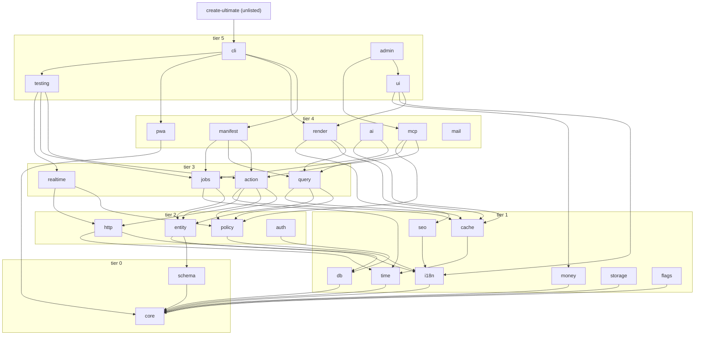

# Package map

29 packages, 6 tiers. **One package = one reason to change.** If two things in a package change for different reasons, they are two packages.

Rationale for the primitives themselves: [`../idea/02-primitives.md`](../idea/02-primitives.md). Enforcement: [`02-boundaries.md`](./02-boundaries.md).

## Tiers

A package may import from **strictly lower** tiers only. Never upward. Never sideways within its own tier, except the listed exceptions.

```
tier 0  core, schema
tier 1  i18n, money, time, cache, seo, db, storage, flags   (may import tier 0)
tier 2  entity, policy, http, auth                   (may import tier 0-1)
tier 3  action, query, jobs, realtime                (may import tier 0-2)
tier 4  render, pwa, mcp, ai, manifest, mail         (may import tier 0-3)
tier 5  ui, admin, testing, cli, scraping           (may import tier 0-4)
```

[`scripts/lib/tiers.ts`](../../scripts/lib/tiers.ts) is the executable copy of this block; `bun run boundaries` reads that one. Prose and code must agree.

| Sideways exception | Why |
|---|---|
| `schema` → `core` | needs `UltimateError` for parse failures. `core` imports nothing. |
| `admin` → `ui` | the admin dashboard *is* the ui kit, composed. Inverting it ships every widget through props. |
| `realtime` → `query` | tier 3 is one feature: a live query is a query plus a subscription. Splitting duplicates the SQL shape. |
| `cli` → `admin` | `x dev` **mounts** `/_x`; it does not reimplement it. The panels are a tier-5 product, and the alternative is a second dev dashboard inside the CLI. |
| `create-ultimate` → `cli` | a published shim whose whole job is `x new`. The alternative is a second copy of the templates. |
| everything else | none. Siblings share **types only**, declared in the lowest tier that needs them. |

### Why `db` is tier 1

Decided **2026-08**, when the Postgres entity driver needed a home. `db` imports `core` and nothing else, so tier 1 is the lowest tier its real imports allow — and placing it there is what lets `entity` (tier 2) own `postgresDriver()` directly, a plain downward import with the same shape as `auth → db`.

| Alternative | Why not |
|---|---|
| a tier-3 `entity-pg` package | `Driver` and its only production implementation would live in two packages — two places to look for "where rows live", and `database()` callers importing the seam from one and the driver from the other |
| keep `db` at tier 2 next to `entity` | a sideways edge earns its line by being irreducible; this one is not, because `db` genuinely depends on nothing above tier 0 |

**Cross-tier interface types live in `core`.** `RouteTable`, `ActorRef`, `ActionRef`, `JobDriver`, `CacheDriver`, `Transport` are declared in `@ultimat3/core` so tier-4 siblings (`pwa` needs the route table, `manifest` needs it too) never import each other. Composition — wiring a concrete route table into `pwa` — happens in `cli` (tier 5), the only package allowed to know about everything.

## Every package

| Package | Tier | Responsibility (one line) | Owns | Must never |
|---|---|---|---|---|
| `core` | 0 | `UltimateError`, ALS request context, ids, build ID, typed env, the image pipeline | the error base + code registry, `ctx` shape, cross-tier interface types, the logger, the one decode/resize/encode path | import any `@ultimat3/*`; do I/O beyond `process.env` and stdout |
| `schema` | 0 | Standard Schema façade; the dependency-free builtin provider exposed as `t`; JSON Schema emit | `t`, `parse`, `toJsonSchema`, `configureSchemaProvider()` — the swap point a third-party adapter plugs into | know about HTTP, DB, or locales; ship an adapter for ArkType, Zod or Valibot |
| `i18n` | 1 | translator, catalog flattening, locale negotiation, loud misses | `t()`, catalog format, `⟦key⟧` rendering, plural selection via CLDR | read a request object; format money |
| `money` | 1 | integer minor units with an attached currency | `Money`, arithmetic, `allocate`, ISO exponent table, `Intl` formatting | floats; cross-currency arithmetic; a bare number as a total |
| `time` | 1 | UTC instants, zone math, cron, durations | `Instant`, `ZonedFormat`, cron parse/next, duration parse (`'3d'`) | format without an explicit IANA `timeZone` |
| `cache` | 1 | four cache tiers behind one tagged invalidation graph | tag algebra, tag serialization, tier drivers | hold business logic; accept a hand-built key |
| `seo` | 1 | metadata, typed JSON-LD, sitemap/robots/feeds, SEO checks | `ld.*`, `<head>` model, sitemap splitting, the SEO check set | render pages; fetch data |
| `db` | 1 | Postgres access, transactions, migrations, drift detection | `sql` binding, `DbClient`, `withTransaction`, the migration ledger, branch/introspect | import `entity` — an entity snapshot arrives as a parameter, never as an import |
| `storage` | 1 | named disks over `Bun.file` and `Bun.s3` | disk registry, safe keys, signed URLs, sniffed uploads | let a call site name a driver instead of a disk |
| `flags` | 1 | feature flags whose expiry is a compile-time proof | `defineFlag`, `isEnabled`, targeting rules, stable `fnv1a` bucketing, `applyFlagSnapshot` for an external control plane | outlive its own expiry — a temporary flag with no `expires` does not typecheck; decide *what* a flag gates |
| `entity` | 2 | a table + its domain type + invariants the DB also enforces | column types, defaults, invariants, tenant column, both repo drivers, cursor codec | business logic; HTTP awareness; policy decisions |
| `policy` | 2 | the one authz rule, evaluated identically in every surface | `can()`, `evaluate()`, denial reasons, actor resolution contract | mutate; query outside declared repos; return partial data |
| `http` | 2 | owned request lifecycle over `Bun.serve` | the ordered pipeline, router, problem+json rendering, ALS establishment | know about `action`/`query` concretely; render components |
| `auth` | 2 | sessions, passwords, OAuth, MFA and api keys — resolved to one `Actor` | credential adapters, session lifecycle, the `Actor` resolution path | authorize anything — it identifies, `policy` decides |
| `action` | 3 | one declaration → route, OpenAPI, client, MCP tool, job handle, tests | `action()`, `mutator()`, the projection registry, the typed client | render or redirect; read raw headers; authorize inside `handle` |
| `query` | 3 | reads, optionally live; tag acquisition from touched tables | `query()`, snapshot execution, tag inference, live registration | write, enqueue, or send mail |
| `jobs` | 3 | durable background work, steps, drivers, outbox, scheduler | step executor, `JobDriver` implementations, claim loop, cron dispatch | serve HTTP; assume exactly-once |
| `realtime` | 3 | three-tier realtime over one protocol and one mutator shape | change feed, incremental matcher, wire protocol, client store | authorize on its own — it calls `policy` |
| `render` | 4 | five render modes, islands, streaming envelope, ISR | mode implementations, hydration emit, streaming protocol, ISR single-flight | contain business logic; import `ui` (higher tier) |
| `pwa` | 4 | `sw.js`, manifest, icons, offline strategies, skew handling | SW codegen + checksum, precache set derivation, build-ID scoping | emit a hand-editable service worker |
| `mcp` | 4 | actions/queries as MCP tools; the dev-server tool set; `defineAppMcp` | tool registry, transport, scope gate, visibility rules | introduce a second authz path |
| `ai` | 4 | `llm()` primitive, versioned prompts, evals, embeddings | provider adapters, structured-output retry, cost accounting, semantic cache | spend past `budget`; inline a prompt string |
| `manifest` | 4 | `x.manifest.json` + `openapi.json` emit and drift detection | the manifest schema, generation, contract diff | generate prose documentation |
| `mail` | 4 | transactional email as data: one template renders HTML and text | block templates, i18n-only strings, token-only colours, transport adapters | send inline — delivery is a job |
| `ui` | 5 | Solid components + design tokens + SCSS modules | primitives, `<Image>`, token source of truth, `data-theme` application | fetch, hold business logic, or run its own authz |
| `admin` | 5 | generated admin dashboard, itself an Ultimate app with MCP on | admin screens derived from entities, its MCP surface | bypass `policy`; ship in the app bundle graph |
| `testing` | 5 | the six test runners, template DB, frozen clock, sealed network | fixture shapes, DB cloning, seeded RNG, egress trap | appear in a production bundle |
| `cli` | 5 | the `x` binary: generators, dev server, `verify` orchestration | command surface, `--json` output, generator templates, composition wiring | contain framework logic — it delegates |
| `create-ultimate` | unlisted (6) | the published `bunx create-ultimate` shim | the `create-ultimate` bin, argument forwarding into `x new` | reimplement a template `cli` already owns |

## Dependency graph

Arrow = imports. Only representative edges are drawn; the tier rule is the complete truth.



## One reason to change

| Symptom | Diagnosis | Fix |
|---|---|---|
| Two unrelated PRs keep touching the same package | it has two reasons to change | split it |
| A package needs a sibling at the same tier | the shared thing is a type, not code | declare the type in `core`, compose in `cli` |
| A package imports upward | the dependency is inverted | pass an interface down, implement it above |
| A file exceeds ~500 LOC | it has multiple responsibilities | split by concern, per [`00-conventions.md`](./00-conventions.md) |

Every package ships `README.md` (what it owns, its public API, why it exists) and `CLAUDE.md` (boundary, deps, commands — under 40 lines). `src/index.ts` re-exports the public API explicitly; `export *` is allowed only for a pure-type module.
