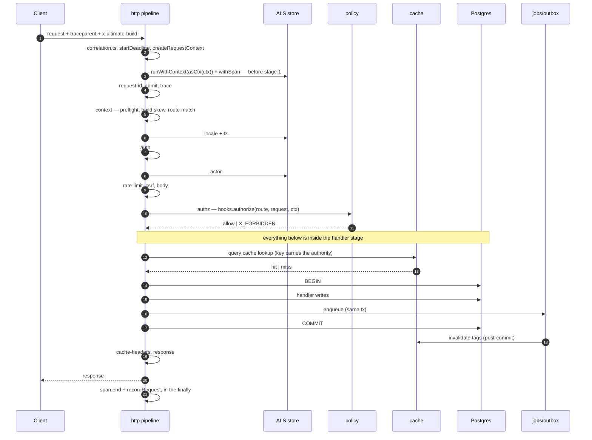

# Request lifecycle

`@ultimat3/http` owns the whole request. A **fixed ordered pipeline**, never a middleware chain a user composes, because the order *is* the security model — an app's own middleware wraps the handler and nothing above it (see Rules). A third-party router cannot own this: `policy` must run on every surface, identically.

## The stages

**Fourteen, in this order.** `PIPELINE_STAGES` in [`packages/http/src/pipeline.ts`](../../packages/http/src/pipeline.ts) is the executable copy and the `why` column is quoted from it — a stage's reason for its index is source, rendered verbatim by the dev dashboard, not prose kept beside the code. `As of 2026-08-23`.

| # | Stage | Phase | Does | Why here |
|---|---|---|---|---|
| 1 | `request-id` | `request` | puts `x-request-id` on `ctx.headers` — the id `correlation.ts` already resolved | every log line, span, error body and problem document quotes it, so it must be on the response before anything can fail |
| 2 | `admit` | `request` | draining → `X_DRAINING`; past `config.maxInflight` → `X_OVERLOADED`, both with `retry-after: 1` | before every other stage does any work: a refusal that costs as much as a served request is not load shedding |
| 3 | `trace` | `request` | puts `x-trace-id` on `ctx.headers` | publishes the id the root span already carries — the span opens *before* stage 1, or it could not adopt the caller's `traceparent` as its parent |
| 4 | `context` | `request` | answers a CORS preflight; checks build skew (`assertBuild`); strips `basePath`; matches the route → `ctx.route`, `ctx.params`. `X_ROUTE_NOT_FOUND`, `X_METHOD_NOT_ALLOWED`, `X_PATH_INVALID` | a preflight carries no credentials, so answering it after `auth` would 401 every legitimate cross-origin call; a stale client must be told to reload before it gets a 404 for a route it no longer knows |
| 5 | `locale` | `request` | `accept-language` + locale cookie → `ctx.locale`; tz header + cookie → `ctx.tz`; sets `content-language` | before auth: even a 401 body is localised, and no date/money formatter may run without an explicit locale + IANA tz |
| 6 | `auth` | `request` | `hooks.authenticate` → `ctx.actor`, `anonymousActor()` for nobody; `meta.auth: 'required'` + anonymous → `X_UNAUTHENTICATED` | before rate limiting so the limiter keys per actor and per tenant instead of punishing a shared NAT address |
| 7 | `rate-limit` | `request` | token bucket on `(actorId, orgId, ip, route name)`; `RateLimit-*` headers on `ctx.headers` either way; `X_RATE_LIMITED` | before the body is read: a limited request must never make the server allocate its payload |
| 8 | `csrf` | `request` | `sec-fetch-site`, `Origin` vs the self origin built from `ctx.https`; `X_CSRF_BLOCKED` (403, never 401) | after auth so it only judges a caller holding an **ambient** credential — a bearer token and an anonymous call are exempt — and before body so a forged write never allocates its payload. CORS cannot cover this: `application/x-www-form-urlencoded` is a simple content type, so a cross-site form post is sent and executed and only the *response* is withheld |
| 9 | `body` | `request` | `route.meta.input` parsed over the size-capped body → `ctx.input`; `X_BODY_INVALID` with issue paths | before authz because policies take the parsed input as their subject (`ownsPost(actor, input.postId)`) |
| 10 | `authz` | `request` | `hooks.authorize(route, request, ctx)` → `ctx.authz` or `X_FORBIDDEN`; returns without deciding for `meta.enforcedBy: 'handler'` | the last gate, and only for a route whose policy nothing downstream evaluates: one policy, decided here exactly as it is in jobs, live queries and MCP tools |
| 11 | `handler` | `terminal` | the matched route's handler, wrapped in the declared middleware | the only stage that is app code |
| 12 | `cache-headers` | `finalize` | reviews what the handler wrote: a shared answer for an identified actor becomes `PRIVATE_CACHE`, an anonymous one gains `SHARED_CACHE_VARY` — `accept-language`, `cookie`, `x-timezone` | after the handler so a handler can override the route default, and before response so a directive cannot drop a security header |
| 13 | `error-map` | `recover` | one throw → one status: sign-in redirect, dev overlay, error page or problem+json; reports 5xx; logs the **code** with the cause as a redactable field | the single place a throw becomes a status: problem+json for agents and RPC, the dev overlay for browsers |
| 14 | `response` | `finalize` | merges `ctx.headers`, CORS, the security headers and `server-timing` onto whatever the stages produced | last: nothing may write a header after it |

Adding a stage is an entry in **both** `PIPELINE_STAGES` and `stages.ts`'s `Record<StageName, StageRun>` — the record type is what makes forgetting one a build error, and `packages/http/CLAUDE.md` requires a `why` and a test with it.

### Four phases, one loop

| Phase | When it runs | How it ends the request |
|---|---|---|
| `request` | in declared order, first to last | a stage returning a `Response` short-circuits the rest; a throw jumps to `recover` |
| `terminal` | once, if nothing short-circuited | its return value is the response; `undefined` is a 204 |
| `recover` | only when something above threw | renders `ctx.error` |
| `finalize` | always — after success and after failure | never; it decorates the response that exists |

`Pipeline.handle()` **resolves to a `Response` or the server has no answer at all.** The request phases are guarded by `execute`'s own `try`; the two that run after them are guarded in `finalize.ts`, and a finalize stage that refuses degrades to `X_PIPELINE_FINALIZE_FAILED` (500) with a second pass over that problem document, so the request id, CORS and the security headers still reach the client. Two passes, never a loop.

**`error-map` is a stage.** This page said "the error mapper is not a stage — it wraps the pipeline" until 2026-08-23, and it was wrong in the direction that matters: the mapper is `PIPELINE_STAGES[12]`, `phase: 'recover'`, reached through `finalize.ts`'s `recoverWith` — which is what lets `cache-headers` and `response` decorate a *failed* request exactly as they decorate a served one. A throw inside the recover stage (an app's `onError`, a `devNotices` producer) is answered with the problem document for the error the request actually hit: the stage that renders a throw has nothing left to render its own.

### Ten stages this page invented, and where the work really happens

The table above carried **18** rows until 2026-08-23, under ten names no `StageName` has ever held, and omitted `csrf` — the one stage standing between a session cookie and a cross-site `<form method="post">` — entirely. The work those names described is real; none of it is a stage.

| Named as a stage until 2026-08-23 | Where it actually happens |
|---|---|
| `accept` | `server.ts`'s `Bun.serve` handler and the `admit` stage — draining is `isDraining()`, core's, never a private flag |
| `route-match` | inside `context` (stage 4), through `matchRoute` |
| `session-resolve` | `auth` (stage 6), through `hooks.authenticate` |
| `tenant-resolve` | **nowhere.** There is no tenant stage and no `ctx.tenantId` on any context in the framework |
| `input-validate` | inside `body` (stage 9) — one stage reads and parses, because a schema failure and a size cap are the same refusal |
| `cache-lookup` | not in the pipeline: `@ultimat3/query`'s `read.ts`, inside `handler` |
| `commit` | the handler's own transaction, inside `handler` |
| `output-validate` | `@ultimat3/action`'s `invoke.ts` (`validateOutput`), inside `handler` |
| `serialize` | the handler's own `Response` |
| `trace-end` | `pipeline.ts`'s `withSpan` and its `finally` — outside the stage list, because it must also cover a stage that throws |

**Tenancy is `ctx.actor.orgId`, and it is enforced one tier up.** `@ultimat3/entity`'s `scopedPlan` (`packages/entity/src/tenancy.ts`) derives the tenant from the acting actor on every plan for a tenant-scoped entity, refuses an actor carrying none (`X_TENANCY_UNSCOPED`) and refuses a plan naming another (`X_TENANCY_ACTOR_MISMATCH`). A pipeline stage could not do it: the guard has to re-prove itself per plan, because `withChildContext({ actor })` swaps the actor without closing the scope.

## Sequence



The `Note` is the half the old diagram drew as pipeline stages: the cache lookup, the transaction, the commit and the output parse are one stage — `handler` — and they belong to `@ultimat3/query` and `@ultimat3/action`, not to `@ultimat3/http`.

## AsyncLocalStorage context

Opened **before stage 1**, in `pipeline.ts`'s `handle()`: `createRequestContext` builds the object, `runWithContext(asCtx(ctx), …)` publishes it, and `withSpan` wraps the whole loop. Not at a stage — a stage that opened the scope would leave every stage above it unable to read the context, and the span would exclude them.

`asCtx` is the **identity function**, not a cast: `RequestContext extends Ctx`, so the compiler is the check. It was `ctx as unknown as Ctx` over an object that set none of `clock`, `now`, `logger`, `signal` or `services` — and `ctx.now()` threw `TypeError: ctx.now is not a function` on every audited action served over HTTP.

```ts
export interface Ctx extends CtxServices {
  readonly requestId: string;
  readonly traceId: string;        // W3C, 32 hex — never a UUID
  readonly actor: Actor;           // never null: "nobody" is the anonymous actor
  readonly locale: string;         // BCP-47
  readonly tz: string;             // IANA. Never format a date without it
  readonly buildId: string;        // the build this PROCESS serves
  readonly role: Role;
  readonly clock: Clock;
  now(): Date;
  readonly logger: Logger;         // a child carrying requestId + traceId
  readonly signal: AbortSignal;    // the deadline OR the caller going away
  readonly services: ServiceBag;
}
```

That is core's declaration ([`packages/core/src/context.ts`](../../packages/core/src/context.ts)) in full, and it is what a handler sees. **There is no `tenantId` and no `span` on it** — this page published both until 2026-08-23. Tenancy is `actor.orgId` (above); a span is opened with `withSpan`, never read off the context.

Why ALS and not a threaded parameter:

| Threading `actor` explicitly | ALS |
|---|---|
| every signature grows a param, so every refactor touches every layer | signatures stay about the domain |
| an omitted param is the single most-dropped detail in agent-written code | structurally unavailable to forget |
| a helper five calls deep either gets the param or invents a default | it reads `ctx` or it has no actor |
| a formatter without a tz param silently uses the server's zone | `ctx.tz` is always present |
| repo calls can forget the tenant filter | `scopedPlan` reads `ctx.actor.orgId` and refuses without one |

Consequences, enforced:

- One `AsyncLocalStorage` in the framework, `packages/core/src/async-context.ts`; every other scope opens through `asyncContext<T>(subject)`. `bun run async-context-guard` is the build error.
- No context outside a request/job/subscription scope: `useContext()` on a module's top level throws `X_NO_CONTEXT` — `fix: wrap the entry point in runWithContext(createContext({ ... }), fn)`.
- Every layer reads actor/locale/tz. **No layer rewrites them.** The mutable slots on `RequestContext` are each filled by exactly one stage, and the table above says which.

## Reading the request from app code

`ctx.headers` is the **response** headers, accumulated by stages before a `Response` exists. The
request's own headers are `ctx.requestHeaders`, set once at construction. App code never gets the
raw `Request`: a `Request` on the context is a second body reader past `UltimateRequest`'s size
cap, its content-type parse and its cache.

| Need | Seam |
|---|---|
| a header, in a route handler or `hooks.authenticate` | `request.header(name)` |
| a cookie, in a route handler or `hooks.authenticate` | `request.cookie(name)` |
| a header, in an action, a page or a service | `useRequestHeader(name)` |
| a cookie, in an action, a page or a service | `useRequestCookie(name)` |

`use*` reads core's ALS, like `useContext()` and `useService()`: an action handler and a page are
handed a `Ctx`, never an `UltimateRequest`, so an ambient reader is the only seam that reaches
both. Outside any context it is core's `X_NO_CONTEXT`; inside a job's or a task's context it is
`X_NO_REQUEST`, never `null` — "no request here" and "the caller sent no cookie" are different
facts, and one `null` for both is how a job runs as nobody.

`hooks.authenticate` turns a session cookie into `ctx.actor`, and the app declares it at import
time:

```ts
configureAuthenticator(async (request) => {
  const token = request.cookie('session');
  return token === null ? null : await authenticate(auth, token);
});
```

`startRoles` reads it back at server start, after `loadApp` has imported the app's modules — so
`x dev` and `apps/web/server.ts` fill the same seam from the same declaration. `@ultimat3/auth`
cannot supply it: it is tier 2, as `@ultimat3/http` is, so it can never import it. The app is the
only place both are in scope.

## Answering with a redirect

A route handler returns `redirect(location, status)`. An action cannot: its return value is its
output schema on **every** surface, and a `Response` returned only over HTTP is two return
protocols for one primitive. It records the intent instead, and the HTTP projection reads it back.

| | Route handler | Action |
|---|---|---|
| how | `return redirect('/feed', 303)` | `setRedirect('/feed')` |
| default status | 302 | 303 |
| who honours it | the handler *is* the response | `toRoute` only — the MCP tool and the job handle share none of a redirect's meaning |

303 by default because the caller is a `<form method="post">`, which `site/` encourages at 0kb JS:
303 turns the follow-up into a GET, so a reload does not repost. Setting `location` on
`ctx.headers` does not work — it lands on the handler's 200, and a browser ignores it.

## One trace across HTTP → job → live query

```
HTTP request  trace=T span=S1
  └─ handler   span=S2
       └─ enqueue(notifySubscribers)   → x_outbox row stores traceparent(T,S2)
                                          + tenant_id + enqueued_by
worker claims the row
  └─ job span S3   parent = T/S2 (continuation, not a new trace)
       └─ step 'send'   span S4
            └─ DB write → WAL
replicator decodes the WAL record, carries trace id T on the change-feed entry
  └─ matcher span S5, link → T/S4
sync frame  { qid, op, row, lsn, trace: T }
  └─ client patch marked with T
```

| Hop | Carrier | Rule |
|---|---|---|
| HTTP → job | `traceparent` column on the outbox row | stored **in the same transaction** as the enqueue, so the trace cannot survive a rollback |
| job → step | parent span per `step.run` | a replayed step emits a `replayed=true` span, not a fake execution |
| job → WAL | trace id in the change record's metadata | best-effort: a change with no originating trace still flows |
| replicator → sync → client | `trace` field on the wire frame | lets a UI patch be attributed to the request that caused it |
| job → job | new span, `link` to the parent | a fanout job is not a child of a single request |

Result: "why did this row appear on my screen" is one trace query, spanning a browser click, an HTTP action, a background job, a WAL record, and a WebSocket frame.

## Rules

- **Stages never reorder.** Adding one is a row in `PIPELINE_STAGES` with its own `why`, an entry in `stages.ts`'s `Record<StageName, StageRun>`, and a test. Two of the three are build errors; the test is `packages/http/CLAUDE.md`'s rule.
- **Middleware exists, and it is deliberately tiny.** `createServer({ middleware })` ([`packages/http/src/server.ts`](../../packages/http/src/server.ts)) composes left-to-right once at start and wraps the matched handler — the one thing the ordered pipeline cannot express. It runs *inside* stage 11, so it can never see a request the pipeline already refused and can never become a second auth, locale or rate-limit path. This page said "no user-supplied middleware" until 2026-08-23, which the seam it was describing had contradicted since it shipped. There is still no plugin API.
- **Authz is decided once.** `meta.enforcedBy` says who: `'pipeline'` (the default) means stage 10 decides through `hooks.authorize`; `'handler'` means the handler holds the row a row-level rule reads and the stage returns without deciding. Deciding in both places is two authz systems, and the one holding less answers first ([`../idea/02-primitives.md`](../idea/02-primitives.md)).
- **Cache never precedes authz** — not for performance, not for public routes. Enforced in `@ultimat3/query`'s [`read.ts`](../../packages/query/src/read.ts), which evaluates the policy before it reads a tier and puts the authority in the key on every read, cached or not. No pipeline stage can do it: the lookup happens inside `handler`.
- **Every response carries `x-request-id` and `x-trace-id`** — stages 1 and 3, set on `ctx.headers` before anything can fail, so a refusal carries them too. `x-ultimate-build` is the *client's* claim on the way in (`config.buildIdHeader`, read by `assertBuild`); on the way out it is written by `@ultimat3/render`'s response builders, not by the pipeline.
