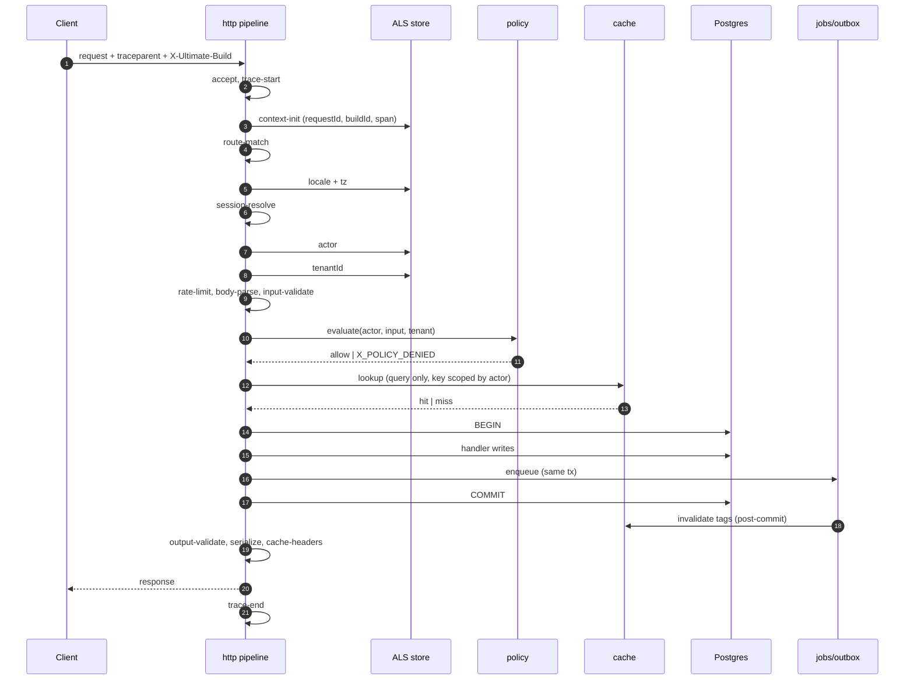

# Request lifecycle

`@ultimat3/http` owns the whole request. Not a middleware chain a user composes — a **fixed ordered pipeline**, because the order *is* the security model. A third-party router cannot own this: `policy` must run on every surface, identically.

## The stages

Order is fixed. Each row states why it cannot move earlier or later.

| # | Stage | Does | Why here |
|---|---|---|---|
| 1 | `accept` | `Bun.serve` handler entry; read `X-Ultimate-Build`; reject if draining | a draining process must answer `503` before spending anything ([`13-topology-runtime.md`](./13-topology-runtime.md)) |
| 2 | `trace-start` | parse `traceparent`, open the root OTel span | must wrap every later stage, including the ones that fail |
| 3 | `context-init` | create the ALS store: `requestId`, `buildId`, `span`, `clock`, empty actor/tenant/locale | everything after reads context instead of receiving params |
| 4 | `route-match` | router resolves path + method → route or action/query ref | a `404` must cost no session lookup, no body read |
| 5 | `locale-negotiate` | path prefix → cookie → `Accept-Language` → default; sets `locale` + `tz` in ALS | **before anything user-facing.** Stages 6–17 can all produce a message (a denial, a validation error); a message chosen before the locale is a message in the wrong language |
| 6 | `session-resolve` | Better Auth: cookie/bearer/passkey → `actor` (identity only, zero permissions) | authz needs an actor; tenancy is derived from actor + host |
| 7 | `tenant-resolve` | host / path / actor claim → `tenantId` in ALS; `X_TENANT_MISMATCH` on conflict | before rate limits, which are keyed per tenant; before any repo call, which requires the tenant |
| 8 | `rate-limit` | token bucket on `(tenant, actor, route)` | after the actor exists (per-tenant fairness), before the body is read (a flood must not cost a parse) |
| 9 | `body-parse` | bounded read, content-type dispatch, size cap | after rate limiting; before validation |
| 10 | `input-validate` | `input` schema parse → typed `input`; failure → `X_INPUT_INVALID` with the field path | authz reads validated input |
| 11 | `authz` | `policy.evaluate({ actor, input, tenant })` → allow or `X_POLICY_DENIED` | **after validation, because policies read validated input.** `ownsPost(actor, input.postId)` on an unparsed body is how type confusion becomes privilege escalation |
| 12 | `cache-lookup` | queries only: tier 1 → 2 → 3, key includes actor scope | **after authz** — a cache hit that precedes a policy check is a cross-tenant leak with a fast path |
| 13 | `handler` | `handle({ input, ctx })` inside a DB transaction (mutations); `<job>.enqueue` joins that transaction | the only user code in the pipeline |
| 14 | `commit` | commit; then release outbox rows and fan out `cache.invalidates` | invalidation *enqueued* in the tx, *executed* after commit: a rolled-back write never purges |
| 15 | `output-validate` | `output` schema parse — always in dev/test, sampled in prod | catches contract drift at the source, not in a client |
| 16 | `serialize` | problem+json, JSON, or the streaming envelope ([`09-rendering-internals.md`](./09-rendering-internals.md)) | needs the handler result and the negotiated locale |
| 17 | `cache-headers` | `Cache-Control`, `ETag`, `stale-while-revalidate`, `Vary` | **after the handler**, because the header depends on what actually happened: render mode, freshness, which tags resolved, whether a stale ISR copy was served |
| 18 | `trace-end` | end span, emit metrics, one structured log line, flush on drain | last by definition |

Any stage may throw. The error mapper is not a stage — it wraps the pipeline: an `UltimateError` renders as problem+json with the stage name attached, localized from the ALS locale set at stage 5. A non-`UltimateError` escaping to the mapper is itself a bug and is reported as `X_INTERNAL` with the original stack in dev.

## Sequence



## AsyncLocalStorage context

Established once, at stage 3, in `@ultimat3/core`. Filled progressively by stages 5–7. Read-only to user code.

```ts
export interface RequestContext {
  readonly requestId: string;
  readonly buildId: string;
  readonly actor: ActorRef | null;
  readonly tenantId: string | null;
  readonly locale: string;      // 'en-US'
  readonly tz: string;          // IANA, e.g. 'Pacific/Auckland'
  readonly now: () => Instant;  // frozen in tests
  readonly span: Span;
}
```

Why ALS and not a threaded parameter:

| Threading `actor` explicitly | ALS |
|---|---|
| every signature grows a param, so every refactor touches every layer | signatures stay about the domain |
| an omitted param is the single most-dropped detail in agent-written code | structurally unavailable to forget |
| a helper five calls deep either gets the param or invents a default | it reads `ctx` or it has no actor |
| a formatter without a tz param silently uses the server's zone | `ctx.tz` is always present |
| repo calls can forget the tenant filter | the repo reads `ctx.tenantId` and refuses without one |

Consequences, enforced:

- `ctx` is a façade over ALS plus the declared repos. Code that reaches the raw store is a boundary violation.
- No context outside a request/job/subscription scope: reading `ctx` on a module's top level throws `X_NO_CONTEXT` with `fix: move this call inside a handler`.
- Every layer can read actor/locale/tz/tenant. **No layer can write them.** Only stages 5–7 write, once.

## One trace across HTTP → job → live query

```
HTTP request  trace=T span=S1
  └─ handler   span=S2
       └─ enqueue(notifySubscribers)   → outbox row stores traceparent(T,S2)
                                          + tenantId + actor id + buildId
worker claims the row
  └─ job span S3   parent = T/S2 (continuation, not a new trace)
       └─ step 'send'   span S4
            └─ DB write → WAL
replicator decodes the WAL record, carries trace id T on the change-feed entry
  └─ matcher span S5, link → T/S4
sync frame  { qid, op, row, lsn, trace: T }
  └─ client patch marked with T
```

| Hop | Carrier | Rule |
|---|---|---|
| HTTP → job | `traceparent` column on the outbox row | stored **in the same transaction** as the enqueue, so the trace cannot survive a rollback |
| job → step | parent span per `step.run` | a replayed step emits a `replayed=true` span, not a fake execution |
| job → WAL | trace id in the change record's metadata | best-effort: a change with no originating trace still flows |
| replicator → sync → client | `trace` field on the wire frame | lets a UI patch be attributed to the request that caused it |
| job → job | new span, `link` to the parent | a fanout job is not a child of a single request |

Result: "why did this row appear on my screen" is one trace query, spanning a browser click, an HTTP action, a background job, a WAL record, and a WebSocket frame.

## Rules

- Stages never reorder. Adding a stage requires a row in the table above and a stated reason it cannot sit elsewhere.
- No user-supplied middleware. Cross-cutting behavior belongs to a stage or to a primitive.
- Authz runs exactly once per request, in `policy`. A second check inside `handle` is a rejected PR ([`../idea/02-primitives.md`](../idea/02-primitives.md)).
- Cache never precedes authz. Not for performance, not for public routes.
- Every response carries `X-Ultimate-Build` and the trace id.
