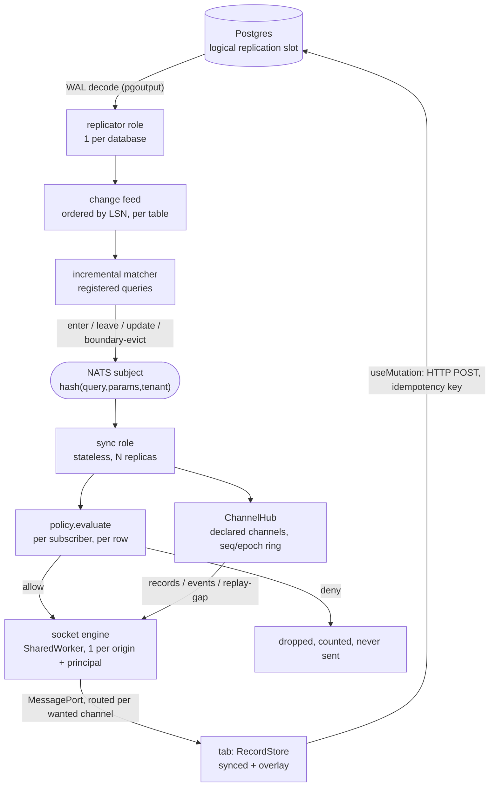

# Realtime internals

How `@ultimat3/realtime` works, server and browser, `As of 2026-09-22` (21.0.0, unreleased; plan
101). The client data layer's design and its decisions are
[`21-client-data-layer.md`](./21-client-data-layer.md); this page is the mechanism under it. Ladder
rationale: [`../idea/03-realtime.md`](../idea/03-realtime.md). Honest sizing:
[`../idea/15-risks.md`](../idea/15-risks.md). Source anchors are file + symbol.

## Pipeline



| Stage | Owner | Guarantee | Cost |
|---|---|---|---|
| WAL decode | `replicator` (1/DB, advisory lock) | ordered by LSN, at-least-once | one replication slot |
| change feed | `replicator` | per-table, monotonic LSN, bounded ring buffer | memory ∝ buffer window |
| matcher | `replicator` | a change touching no registered query costs one hash lookup | CPU ∝ registered query *shapes*, not subscribers |
| fanout | NATS | subject carries no per-socket state | network ∝ subscriber groups |
| socket + policy | `sync` (stateless) | a row failing policy is never written to the wire | CPU ∝ delivered rows × subscribers |
| channels | `sync` (`ChannelHub`) | each node derives a declared channel's records from the change stream it already subscribes to; no write names a channel | a ring of recent frames per open topic |
| one socket per origin | the browser (`socket-engine.ts` in a `SharedWorker`) | one membership per topic across tabs; frames routed only to ports that want them | one socket per origin and principal |
| store | each tab (`RecordStore`) | one record per `type:key`, updated once, shown everywhere | memory ∝ held records |

Writes never ride the socket. The `mutate` and `rebase` frame kinds and `createSyncNode({ onMutate })`
are deleted (sync protocol 3): no host ever wired `onMutate`, so every socket write answered
`X_NOT_IMPLEMENTED`. A write is the mutator's action over HTTP ([below](#writes-go-over-http)).

## Change feed record

```ts
// packages/realtime/src/changefeed.ts
export interface ChangeEvent<R extends Row = Row> {
  readonly entity: string;         // entity name; the matcher's dependency sets are in entity terms
  readonly op: 'insert' | 'update' | 'delete';
  readonly before: R | null;       // requires REPLICA IDENTITY FULL, see below
  readonly after: R | null;
  readonly lsn: string;            // the only ordering authority — see below
  readonly txid: string;
  readonly orgId: string | null;   // hoisted out of the row so fanout filters without parsing it
  readonly at: number;             // commit time, epoch ms
}
```

`before` is mandatory for correct matching: deciding whether a row **left** a result set requires the old values, and with Postgres's default replica identity a delete replicates only the key columns.

**It is warned about and counted, never refused `As of 2026-08-19`.** Three facts, and the third is
the gap:

| | State |
|---|---|
| the code | `X_LIVE_REPLICA_IDENTITY` exists, is registered and is in the manifest (`packages/realtime/src/errors.ts`) |
| the check | `warnPartialIdentity` is preflight's fourth question — it asks `pg_class` which replicated tables sit on `relreplident <> 'f'` and logs the code with the exact `ALTER TABLE` per table (`packages/realtime/src/pg-preflight.ts`). It runs **before** `pg_create_logical_replication_slot`, because a slot decodes with the identity the catalog held when the rows were written |
| the counter | `ReplicationStreamStats.partialBefore` increments on every non-insert change whose relation is not on identity `f` (`pg-replication.ts:372`) — the running half of the same fact |
| the generator | `x db gen` emits `ALTER TABLE … REPLICA IDENTITY FULL` for every table a live query declares in `subscribes:`, since 2026-08-26 (`GENERATABLE_FORMS` in `@ultimat3/db`) |
| the refusal | **missing.** It warns rather than throws, deliberately: every app on the default identity would otherwise stop booting, and a replicator that will not start is worse than the partial rows it is complaining about. A table a live query reads but does not name in `subscribes:` gets a log line and no build error |

The reference app's `posts` and `likes` carry it at `examples/dummy/packages/db/migrations/0001_init.sql:129-130`. Per axiom 3 the *hard* rule still does not exist: a warning is not a build error → [`wiki/Known-Gaps.md`](../../wiki/Known-Gaps.md).

### The lsn is a pair, not a WAL position

`lsn` is `<16 hex commit position><8 hex row position inside that transaction>` — 24 characters, zero-padded so string order *is* stream order. Neither half is usable alone:

| Candidate | Why it fails |
|---|---|
| commit lsn | every row of one transaction shares it, and the replicator drops anything that does not strictly increase — a five-row insert would deliver one row |
| per-record WAL position | logical decoding emits **transactions** in commit order, so a later-committing transaction can carry lower record positions than an earlier one |
| a counter, or the clock | not reproducible; a replay would produce new lsns and at-least-once delivery would duplicate instead of dedupe |

The pair is monotonic in delivery order *and* byte-identical on replay. The row position counts every replicated row, selected or not, so narrowing the entity list cannot renumber a stream a resume cursor already points into.

`PgLogicalReplicationFeed` speaks the Postgres v3 protocol directly (`pg-wire.ts`, `pg-auth.ts`, `pg-connection.ts`, `pg-socket.ts`) and decodes `pgoutput` (`pgoutput.ts`) — no driver dependency, because a replication connection is CopyBoth and no pooled client will hand one over. It asks **four** preflight questions — `wal_level`, the publication, the replica identity of every entity it replicates, and the slot's decoder plugin. Three throw with a `fix:` of their own, so the misconfigurations that produce an unreadable server message each get an instruction instead; the identity one warns, for the reason above. `slot` and `publication` are interpolated into simple queries, so `assertIdentifier`'s charset is the injection boundary — re-asserted inside `preflight` rather than trusted from the constructor.

## Incremental matcher

Registered queries are stored by shape, not by subscriber:

```
registry: Map<tableName, QueryShape[]>
QueryShape = { queryId, predicate(row, params), orderBy, limit, tables, paramsHash }
```

For each `ChangeEvent`:

| # | Step | Result |
|---|---|---|
| 1 | look up shapes registered on `table` | miss → one hash lookup, done |
| 2 | evaluate `predicate(before)` and `predicate(after)` | `false→true` = enter, `true→false` = leave, `true→true` = update, `false→false` = ignore |
| 3 | for a windowed query (`orderBy` + `limit`), compare the row's sort key to the cached **boundary key** | an enter inside the window emits `insert` **plus** a `boundary-evict` for the row falling off the end |
| 4 | emit one patch op per affected `(queryId, paramsHash, tenant)` group | published to that group's NATS subject |

Constraints that make step 2 cheap enough to be honest about:

- `live: true` requires a **deterministic, bounded** `sql`: total `orderBy` + `limit`, no non-deterministic functions. What enforces it is `assertMatchable` (`packages/query/src/matcher.ts`), which refuses a shape the matcher cannot patch incrementally — an unsupported clause, or a filter operator outside `= != in > >= < <=` — with `X_MATCHER_UNSUPPORTED` and the fix "set `live: false` and poll, or reshape to equality filters + `orderBy` + `limit`". There is no separate `X_QUERY_UNBOUNDED`.
- Predicates must be evaluable against a **single row of a single entity**. `match` returns no patch at all when `event.entity !== shape.entity` (`packages/query/src/matcher.ts:56`), so a join is not a slower live query — it is not one. `Builder#raw(feature)` is how a source declares a shape the matcher cannot patch, and `assertMatchable` refuses it at subscribe time.
- **There is no re-execution fallback, and no aggregate deltas.** `As of 2026-08` the refusal is the whole behaviour: unmatchable is `X_MATCHER_UNSUPPORTED`, never a more expensive correct answer. An honest refusal beats a silently wrong result set, and a fallback nobody wrote is worse than both.
- **Nothing reports which class a query is in before it is subscribed to.** `assertMatchable` runs inside `toLiveQuery` (`packages/query/src/live.ts:126`), which nothing outside `@ultimat3/query` calls, so the refusal arrives at subscribe time and not at build time. There is no explain command — shipped, planned or otherwise.

## Policy is per subscriber, never per query

Two clients can subscribe with **identical** `queryId` and params and still be entitled to different rows: row-level policy reads actor attributes (role, team, ownership, org membership), not just the query parameters.

| Collapse policy to the query | Consequence |
|---|---|
| evaluate once per `(queryId, params, tenant)` and fan out the same rows | the first subscriber's entitlements become everyone's. A member sees an admin-only row because an admin subscribed first |
| cache the allow decision by query hash | privilege escalation with a cache hit rate |

So: fanout is grouped by query shape (that is what makes it scale), and **`policy.evaluate` runs on the `sync` node for every subscriber × every candidate row before the frame is written**. Same `evaluate`, same actor resolution, same denial reason as HTTP and MCP — one authz system ([`../idea/02-primitives.md`](../idea/02-primitives.md)).

`liveQueryDefinition(query, { ctx })` is what makes that reachable from a declared `query({ live: true })`, and the split is in the file: what it caches per query id is the compiled source, the shape and the matcher, and what it never caches is a decision.

| Keyed by | Built | Holds |
|---|---|---|
| query id | once, with `enforce: false` — **no subject at all** | source, shape, matcher, the shared pre-policy row window |
| subscriber | `authorize` at every subscribe, `visible` at every row of every delivery | the decision, and nothing else |

The `enforce: false` is the point rather than a shortcut: building the shared half under the *first* subscriber's authority and then caching it by query id is precisely how that subscriber's entitlements become everyone's. It removes no check — `authorize` is still the subscribe-time decision, and it still runs once per subscriber.

Making that affordable:

| Technique | Detail |
|---|---|
| Subscribe-time snapshot check | the window is read once per subscribe through the query's own source, then filtered per subscriber by `visible` |
| Per-delivery re-check | the incremental path re-checks each row; a denial drops the row and increments a counter |
| Pure predicates | policies must not do I/O; a policy needing a lookup declares the repo, and that lookup is memoized per request/subscription |
| No decision memo | **nothing caches an allow.** A bounded LRU keyed `(actorId, policyId, rowTenant, rowOwnerId)` is the only shape that could ever be safe here, and it is not shipped: without an actor-scoped invalidation to clear it, a TTL of seconds is a revoked grant that keeps delivering rows for seconds. `@ultimat3/query`'s `policy-gate.ts` says the same thing in one line — *its result is never cached* |

A dropped row is a metric (`live.rows_denied`), never a client-visible error — telling a client "there is a row you may not see" is itself a leak. `LiveQueryRegistry` counts every drop (`rowsDenied`) and reports each one through `onRowDenied`, carrying the query id, the subscription, the actor and the row id — never the row.

That is a **denial**. A gate that never reached a decision — a rule whose lookup timed out, a predicate with a typo in it — is a different fact and gets a different number: `live.gate_failed` (`gateFailures`, reported through `onGateFailed` with the stage, the row id and the error). Reading one as the other publishes an outage as a permission change, which is silent by construction: the rows leave the screen and the drop counter explains why.

| Stage | Denial | Failure |
|---|---|---|
| `subscribe` snapshot | row dropped | raises out of `subscribe` — a snapshot missing the undecidable rows is a short result set the client renders as the whole one |
| `deliver` patch | dropped, or a `delete` when the subscriber holds the row | that one subscriber is desynced and re-snapshotted next flush; the fanout to the rest completes |

A patch whose row the shared window does not hold is a third answer and neither of these: an update patch carries the changed columns only, so there is no whole row to decide about. It is withheld — dropped, or the one `delete` that tells a subscriber holding it so — and counted as neither, because nothing decided anything. The window *is* the result set.
| `reauthorize` | unsubscribed, sid returned in `dropped` | the subscription survives, desynced — the row gate still decides every row under the new actor, from the same policy `authorize` consults |

### One lane per query id

The shared window is a read-modify-write across awaits — match, apply the patches, append to the retained buffer, then one policy pass per subscriber — and nothing upstream orders the callers. The `sync` node fires `void registry.deliver(change)` off its bus subscription, because the handler has to return before the next change arrives. Two changes back to back therefore both start, and an interleaved fanout hands one subscriber lsn 2 and then asks it to fold lsn 1 on top: the row settles at the older value, and the cursor is rewound to 1, so the next reconnect replays it again.

`WindowLock` gives every entry a FIFO lane and `deliver` enters every lane before it awaits any of them. Across query ids nothing is ordered and nothing needs to be — a qid pins the query *and* its input, so two entries share no state. Three properties make the lanes safe to hold at once:

| Property | Why |
|---|---|
| No fanout ever takes a second lane | holding all of them at once cannot be a cycle, and entering them all up front is what queues two deliveries onto each query id in call order |
| Each task chains on a settled shadow, never on its own promise | one fanout that threw rejects its own caller; the changes queued behind it still run |
| A lane that fails desyncs its own subscribers, and `allSettled` lets the rest finish | the window advanced under a fanout that did not, so those subscribers hold a cursor below the change; awaiting one entry before entering the next let a throw skip every entry behind it with nobody desynced |

The definition's read shares the same lane and the same rule. It happens **once per entry**: a cold subscriber arriving while another's read is in flight joins it rather than issuing a second one, then runs its own policy pass over the result — the read is shared, the authz is not. It is a share and not a cache; the in-flight promise is cleared as it settles, so a subscriber arriving later reads current rows. And the window it produces is assigned in the lane and only ever forwards: a snapshot that resolved after a newer change had already been fanned out is discarded, because writing it back would hand that subscriber rows the fanout has moved past, at a cursor behind the change that would have corrected them.

The one gate pass outside the lane is a resume, and it reads the live window deliberately: the window can only have moved forwards, and a row whose grant was revoked in the meantime is one the pass must refuse rather than replay from the state it had at the cursor's lsn. An entry nothing has read yet has no live window at all, so a resume onto a cold one fills it first — conditional on purpose, because re-reading per resuming subscriber is the cost a delta resume exists to skip in a restart storm.

## Declared channels

A channel is a declaration, never a string: `channelRef(name, { params, catchUp })` is the browser
half, and `channel(ref, { records, policy, row?, events? })` the server half, which registers itself
(`channel-ref.ts`, `channel-decl.ts`, `channel-registry.ts`). `new ChannelHub({ transport, sockets })`
serves every registered one. The raw-topic hub API (`guard`, `subscribe(socket, topic)`,
`publish(topic)`, `publishFrame`, `channelFrame`, `TopicGuard*`) is deleted.

| Kind | Source | Carries | Store |
|---|---|---|---|
| `records` | `ChannelHub.deliverChange(change)`, fed the same `ChangeEvent` stream as `LiveQueryRegistry.deliver`; a committed row of a listed entity, matched to the topic by its param columns | `{ channel, seq, epoch, adopt?, remove? }`, keyed record type → record key → row | adopted into the tab's `RecordStore`, never into a handler |
| `events` | `hub.publishEvent(decl, params, event)` on a channel declared `events: true`, across nodes by the transport | an app payload; a presence roster is `{ presence: op, members, total? }` | never; handlers only (`onEvent`, `onPresence`) |
| `replay-gap` | the hub, when it cannot prove a socket holds a topic's frames | `{ channel, epoch }` | the client re-runs the channel's `catchUp` query |

### Sequence, epoch, ring

Each open topic on a node has a `ChannelRing` (`channel-ring.ts`): an **epoch** (a fresh mark minted
by this hub, `uuid()`-based, so a restarted node can never reuse one), a monotonically increasing
**seq**, and the last `DEFAULT_CHANNEL_RING = 256` records frames. The ring is dropped with the topic's
last local member, and the next member gets a new epoch.

| Situation | The node | The client (`client-channels.ts`) |
|---|---|---|
| steady state | one `records` frame per change, `seq + 1` | applies frames with `seq` above its contiguous cursor; a duplicate (`seq <=` cursor) is dropped |
| a numeric hole | nothing | **not a gap**: a seq this socket never received is skipped. Only `replay-gap` is a gap |
| a dropped frame (backpressure) | `SocketRegistry.deliver` counts it (`channel_frames_dropped_total`), marks the (socket, topic) gapped, and sends one `replay-gap` once the socket drains, counted in `channel_replay_gaps_total` (announcements, by design) | re-runs `catchUp`, holding frames that arrive meanwhile, then applies them in order over the read |
| a resubscribe with `since` | replays from the ring, or answers `replay-gap` when `since` is out of it, from another epoch, or in the future | same |
| **the first join**, no cursor, on a channel with records | answers one `replay-gap` (`channel-logs.ts`, `resume`) | one catch-up read, which covers rows written between the page's render and its join |
| a new epoch on a frame | — | treated as a reset: catch-up, then the frame |

A dropped `events` frame is ephemeral and only counted. A channel with no records (typing, cursors)
gets no first-join gap: there is nothing to re-read.

### Subscribe-time policy

`subscribeChannel(socket, { channel, params, since? })` resolves the declaration by name: an
undeclared name is `X_TOPIC_FORBIDDEN`. The declaration's `policy` runs with the params as input and
`row`'s answer as its subject (`channel-authz.ts`). Records are **not** gated per row: the topic's
params are the scope, so a channel that must hide rows is declared narrower. A denial is latched per
(socket, topic) until the session changes.

**A policy that fails is not a policy that denied.** On re-authorization (`ChannelHub.onActorChange`)
only a denial unsubscribes the topic. Anything else keeps the subscription, increments
`hub.guardFailures` and logs `channel.guard_failed`: a store that timed out is an outage, not a
revoked grant. The **initial** subscribe is deliberately not split this way: there is no
subscription to keep, so a policy that raises rejects the subscribe and the client is told.

### Local fanout

Bun's native WebSocket pub/sub is not used: a native publish can neither be refused per socket, nor
report the frame it dropped, nor mark a subscriber for repair. Local delivery is
`SocketRegistry.deliver`, reading a per-topic index rather than walking the socket table.

## Inbound frames: lanes, and what lanes cannot do

Outbound ordering is the lane per query id above. Inbound ordering is a separate mechanism with a separate unit, because `sync-node.message` dispatches every frame as `void (async () => routeFrame(…))()` — nothing upstream orders them, and a router that awaits a policy or a snapshot read finishes in whatever order those settle.

**Not one lane per socket** (`frame-lanes.ts`, `As of 2026-08`). A global per-socket lane puts every frame behind the slowest one, and the slowest one is a snapshot read — a database round trip every reconnecting client pays once per live query, which is the restart storm the benchmark measures.

| Frames | Lane key | Why that is the unit |
|---|---|---|
| `subscribe` on a query | `sub:<sid>` | `add` then `drop` for one sid, or the drop finds nothing and the add strands the subscription it was meant to end |
| `subscribe` on a channel | `channel:<name>:<params>` | one membership, the same add/drop pair |
| `hello`, server-authored kinds | none | they read state and write none of it |

A lane exists only while something is queued on it — the map is empty between frames, because a lane keyed by a client-chosen sid that outlived its work would be an unbounded map one socket can grow at will.

### Caps are reservations, not checks

**A lane does not bound a cap.** N sequential subscribes still pass a check-then-act limit N times, and one of the caps is per *tenant*, which spans sockets where no lane can see it. So every refusal a subscribe can answer with is decided **synchronously, before the first `await`**, against a count that already includes the subscribes still in flight:

| Reservation | Decides | Held until |
|---|---|---|
| `SubscriptionBook.reserve(socket, sid)` | the sid claim (`X_SUBSCRIPTION_ID_TAKEN`), `maxPerSocket`, `maxPerTenant` | the subscription is attached, or the attempt fails — a `finally`, so releasing twice is a no-op |
| `ChannelHub.subscribeChannel`'s claim + `#reserve(topic)` | `maxTopicsPerSocket`, `maxTopicsPerNode`, and the node's one bridge slot for that topic | the socket joins the topic, or the guard denies and the slot is given back |

The bug both close is the ordinary case, not an attack: one WebSocket write carrying N subscribe frames is dispatched concurrently, N of them read a count nothing had grown yet, and every cap was bypassed by batching. The per-socket claim map is a `WeakMap` keyed by the socket, so a connection that dies mid-subscribe takes its claims with it.

### `qid` is a truncated SHA-256

A `qid` is `<name>:<first 16 hex of SHA-256(canonicalJson(input))>` — 64 bits, `As of 2026-08`, replacing a 32-bit FNV-1a. It is `@ultimat3/query`'s `queryHash(name, input)`, over `@ultimat3/core`'s `canonicalJson`/`fingerprint`; realtime held a second spelling of both until 2026-08-19, and the two already disagreed on an input carrying an `undefined`-valued key. One derivation, across the declared `realtime → query` edge. The hash is a **sharing** key: a hit is answered with the existing entry and the seated window, both carrying the first subscriber's input, compiled source and rows, and input is client-chosen — so a second input colliding with the first passes `authorize` against its own arguments and is then served out of somebody else's window. 32 bits is a collision found offline in seconds. The cursor no longer carries a result-set digest at all — `LiveCursor.digest`, `LiveCursor.count`, `digestOf` and `fnv1a` were deleted in 12.0.0, because every snapshot hashed every row for a value no code path read.

**Deploy consequence, stated once:** a client resuming with a cursor minted under the old format names a `qid` the new node's ring has never held, so `since()` misses and the resume takes the snapshot path (`out-of-window`). One bounded query per subscription, for the length of a rolling deploy. Correct, and not free.

## Shutdown is two phases on a `sync` node

`listenSyncNode` registers both, and `stop()` unregisters both — a hook left behind after the listener is gone drains a node that is already stopped, and the next process-wide shutdown hangs on it.

| Phase | Hook | Effect |
|---|---|---|
| `accept` | `node.stopAccepting()` | `ready = false`: `/readyz` answers 503 and an upgrade arriving anyway is shed with `retry-after-ms`. **Sockets are untouched** — a draining node still owes its clients their patches, and `stop()` is what releases the change subscription that carries them |
| `close` | `node.drain()` then `node.stop()` | `reconnect` frames with per-client delays, the grace window, then close; then the change subscription, the presence sweep and the re-auth interval are released |

Registered with no phase, both landed in `close`, and until that last phase ran `fetch` went on upgrading new websockets onto a process that was going away.

## Cursor and reconnect

Every live-query frame carries an LSN, and the client's last-seen LSN makes a reconnect a delta
instead of a refetch. Handshake, as the frames are:

```text
client → { type: 'hello', v, buildId, sessionId: null, actorId }
server → { type: 'hello', v, buildId, sessionId: <socket id>, actorId }
       → { type: 'update-available', buildId } when the socket is build-skewed

client → { type: 'subscribe', v, op: 'add', sid, target: { kind: 'query', qid: <name>, input, cursor } }
server:
  1. reserve the sid and the caps, synchronously
  2. authorize(actor, input), then resolve the shape
  3. cursor === null              → snapshot frame
     cursor inside the window     → patch frame, re-filtered per subscriber   (zero DB work)
     cursor outside / over budget → snapshot frame at the current lsn       (one bounded query)
```

`target.qid` is the query **name** client → server; the node derives the real qid from
`(name, input)`, so a client can never choose its own fanout key. A snapshot carries `keys`, parallel
to `rows`, and a patch carries `key`, each only when a record key differs from the row's `id`: the
server renders keys with the entity's projection, so a composite-key entity can be live and the
browser never derives a key. `ack` now carries only a refusal: the sid of a refused subscription, or
the socket id for a frame the node could not read.

**`PROTOCOL_VERSION` is 3** (`wire-version.ts`). The version guards incompatibility, never novelty:
v2 → v3 deleted `mutate`, `rebase` and `presence` and added `records`, `events` and `replay-gap`, so
a v2 client and a v3 node refuse each other with `X_PROTOCOL_VERSION`. v1 → v2 (2026-08-24) deleted
`LiveCursor.digest` and `count`, read through a throwing `str`/`num`. An additive optional field and a
field read through `list()` stay at the same number, because `decode` builds a whitelist object.

### Cost model

| Scenario | Path | DB cost | Notes |
|---|---|---|---|
| Reconnect inside the buffer window | buffer replay | **0** | the common case: a blip, a laptop lid, a rolling deploy |
| Reconnect outside the window | snapshot | 1 bounded query per subscription | bounded by `limit`, index-backed |
| Cold subscribe | snapshot | 1 bounded query | same as any page load |
| Steady state | matcher + fanout | 0 | changes only |
| Buffer sizing | `buffer.window` per query group; default 30s of ops, capped by bytes | memory | tuned by hand — no command reports the window |
| Never | replaying arbitrary WAL history per client | — | rejected design: it makes reconnect O(history) |

**Snapshot fallback, never WAL replay.** Outside the window the client gets a fresh snapshot at a current LSN. Cost is one bounded query, never history traversal.

### Thundering herd

| # | Mechanism | Effect |
|---|---|---|
| 1 | Server-directed `reconnect` frame on drain, with a per-client `afterMs` | reconnects arrive spread over a window, not as a spike |
| 2 | Window computed from live connection count | 500 clients drain in a second; 500k spread over minutes |
| 3 | `resumeFrom` LSN | reconnect is a buffer delta, not a resubscribe-and-refetch |
| 4 | Stateless `sync`, no sticky sessions | the load balancer redistributes clients across remaining nodes |
| 5 | Browser backoff is a floor | a socket lost without a frame redials on `browserBackoff`: 500 ms base, factor 2, **`equal`** jitter, capped at `BROWSER_RECONNECT_MAX_MS = 4_000` (`thundering-herd.ts`). The server-side `defaultBackoff` (`full`, 30 s) is not a browser's curve: after a deploy it left the returning node unreached for 27 s. The arithmetic is `@ultimat3/core`'s `backoffDelay`, and this package's attempt is 0-based, so its wrapper passes `attempt + 1` ([`20-flight-control.md`](./20-flight-control.md)) |
| 6 | Per-tenant subscription caps | `X_SUBSCRIPTION_LIMIT`, taken as a reservation; the per-tenant scope only when both `maxPerTenant` and `tenantOf` are supplied |
| 7 | `AcceptBudget` on the upgrade path | a token bucket per node, `perSecond: 500`, `burst: 2000` by default (`sync-node.ts`). A refused upgrade is a `503` with a jittered `retry-after-ms`, decided before any query runs. A second bucket per socket (`maxFramesPerSecond`) sheds inbound frames |

There is no snapshot admission control: what bounds duplicate snapshot work is `entry.reading` in
`query-window.ts`, one shared read per window.

## The browser: one page handle, one store, one socket

### The page handle

Every island is its own bundle, so a module singleton is one per island. Page state lives on
`globalThis` under `Symbol.for` keys instead:

| Key | Owner | Holds |
|---|---|---|
| `ultimate.client` | `@ultimat3/core` (`record-sink.ts`, `pageClient()`) | the `RecordSink` slot, the socket slot, the principal scope cell, the pending-records buffer, the outbound-header slot |
| `ultimate.realtime` | `@ultimat3/realtime` (`page-store.ts`, `pageRealtime()`) | the `RecordStore`, the sync target, the socket client, the page's write counts |

`installRealtime({ signal: createSignal })` gives the hooks this bundle's Solid signal factory; `x build`
prepends it to every island whose own graph imports `@ultimat3/realtime`
(`packages/cli/src/island-realtime.ts`). The sync target comes from the document's
`<meta name="ultimate-sync">` (`sync-meta.ts`).

### `RecordStore`

`record-store.ts`. One per tab, installed as core's `RecordSink`, so `clientTransport` adopts HTTP
records into it without importing this package.

| Property | Rule |
|---|---|
| key | `type:key`, from the server on every path: an envelope's `records`, a snapshot's `keys`, a patch's `key`. A live window whose node named no type keeps its rows under `?query:<name>` (`unnamedType`) |
| two layers | **synced** is server truth; the **overlay** is every pending optimistic write, replayed over synced truth on every change |
| a patch omitting a field | never clears it |
| a restored row | provisional: the first server row for that key wins outright |
| a rejected row | not an object, or no key: dropped and reported, `X_RECORD_REJECTED` |
| lifetime | reference-counted per record; the last release evicts it |
| rescope | every record cleared |

Lists hold **ids**. `useQuery` resolves rows from the store, for live and non-live reads alike. A
non-live read's order is the envelope's `records[type]` key order, and an answer with no envelope
holds its own rows (`use-query.ts`).

### Writes go over HTTP

`useMutation` (`use-mutation.ts`), in order:

| # | Step |
|---|---|
| 1 | push the mutator's `local` twin into the overlay under `<name>:<uuid>`: visible in every island before the call returns |
| 2 | `POST actionPath(name)` through `clientTransport`, with that key as the idempotency key |
| 3 | adopt the answer's records, **then** settle the overlay, so nothing flickers |
| 4 | a row the overlay wrote but the answer did not carry: if the server already reached it during the write (`#hear`; a restored row does not count), it settles; otherwise it waits for a server row, capped at 10 s (`DEFAULT_AWAIT_SERVER_MS`) |
| 5 | `X_CLIENT_TRANSPORT_FAILED` with `meta.failure: 'network'`: queued in the outbox, overlay kept, resolves `undefined`. `'status'`: rejects and drops the overlay. `'body'`: rejects and keeps the overlay until a server row |
| 6 | any other refusal drops the overlay; a supersession by `rescope` is not counted as a failure |

Conflicts resolve through core's `resolveConflict` over rows (`'server-wins'`,
`'last-write-wins'` on a numeric server-written `updatedAt`, or `custom(merge)`); a
`last-write-wins` mutator whose entity has no numeric clock is refused at declaration,
`X_MUTATOR_CLOCK_MISSING`.

### One socket per origin

| Module | Role |
|---|---|
| `socket-engine.ts` | the socket's lifecycle: dial, beat (15 s), redial on `browserBackoff`, reap. Host-agnostic |
| `socket-routes.ts` | one membership per topic and live query across ports; every server frame routed only to the ports that want it, never broadcast |
| `socket-port.ts` | the port messages: `open`, `frame` (a wire frame, encoded as a socket carries it), `close`, `bye` |
| `socket-host.ts` | the tab side: a `SharedWorker` named `ultimate-sync:<scope>` from `<meta name="ultimate-sync-worker">`, or, when `SharedWorker` is absent or throws, the same engine in the page over a `MessageChannel` |
| `sync-worker.ts` | the worker entry, served at `/_x/sync-worker/<hash>.js`, `immutable` |

Each tab keeps its own `LiveClient` and store; to it, its port is a socket. A tab sends `bye` on
`pagehide`, and a port silent for `REAP_AFTER_BEATS = 3` beats is reaped, because a `MessagePort` has
no close event. Two principals get two workers and never share a socket. A new principal makes the
tab `bye` the old worker and redial.

### Offline: persister, outbox, boot

| Piece | Rule |
|---|---|
| store | IndexedDB (`local-store-idb.ts`), every entry keyed `[scope, type, key]`; scope `p:<principal>` or `anon`; an unscoped page persists nothing. Blocked storage falls back to memory with one `X_LOCAL_STORE_UNAVAILABLE` warning |
| persister | `record-persister.ts`: the types a private document lists in `<meta name="ultimate-persist">`, from `entity(name, { persist: true })`. Synced rows only, never an overlay. Debounced 250 ms, flushed on `pagehide` and when hidden |
| outbox | `page-outbox.ts` over `offline-queue.ts`: one queue per principal, replayed **in order** over HTTP with each write's original idempotency key, on socket up, on `online`, and on the service worker's `OUTBOX_DRAIN_MESSAGE`. A retryable failure stops the pass; a refusal is final and rolls back its overlay |
| boot | `@ultimat3/realtime/boot`, one deferred classic script per private document (`/_x/page-boot/<hash>.js`): wipes every stored scope except the current principal's, restores this principal's rows before the socket connects, and opens the outbox |
| rescope | in-page: wipes the previous scope's rows and queue |
| sign-out | the response's `Clear-Site-Data: "cache", "storage"` (`@ultimat3/auth`'s `signOutHeaders()`) first; the boot wipe is the second line |

Trade-off: two principals in two tabs of one browser. The newer boot wipes the other's disk; that tab
keeps its records and queue in memory and re-persists them on its next write.

## Limits — stated plainly

| Limit | Reality |
|---|---|
| Matcher generality | single-row, single-entity predicates only. Joins and non-trivial aggregates are **refused** at subscribe time (`X_MATCHER_UNSUPPORTED`), never re-executed |
| Matcher throughput | CPU on one `replicator` per database. A high-write table with many distinct query shapes is the bottleneck, not socket count |
| Memory per subscriber | grows with subscribed-result size |
| Ordering | per table, by LSN. No cross-table transactional snapshot on the wire |
| Delivery, live queries | at-least-once. A patch backpressure drops marks the subscriber `desynced`, and the next change re-snapshots it |
| Delivery, channel `records` | repaired: a drop is announced with `replay-gap` and the client re-reads `catchUp`. **Not measured at scale**: the committed benchmark runs predate it, and ran the 30 s backoff curve |
| Delivery, channel `events` | at-most-once, counted, never repaired |
| Two-tab e2e | the shared socket is not yet exercised by a two-tab end-to-end test in CI |
| Escape valve | if the reconnect benchmark says the matcher is the bottleneck, adopting an existing open sync protocol beats defending ours |

## Codes

Every code below is registered; the full row per code is [`wiki/Error-Codes.md`](../../wiki/Error-Codes.md).

| Code | Meaning |
|---|---|
| `X_SUBSCRIPTION_LIMIT` | a per-socket, per-tenant or per-node cap was reached |
| `X_SUBSCRIPTION_ID_TAKEN` | one socket reused a `sid` it already holds |
| `X_MATCHER_UNSUPPORTED` | a `live: true` shape the incremental matcher cannot patch |
| `X_REPLICATOR_SLOT_HELD` | a second replicator found the advisory lock held |
| `X_CURSOR_STALE` | the cursor is outside the retained window and no snapshot path was supplied |
| `X_FRAME_RATE_LIMIT` | one socket sent frames faster than this node routes them |
| `X_TOPIC_FORBIDDEN` | an undeclared channel, or the declaration's policy denied the actor |
| `X_CHANNEL_DECLARATION_INVALID` | a `channel()` declaration cannot route its rows |
| `X_PROTOCOL_VERSION` | the client and the node speak different wire versions |
| `X_REALTIME_UNINSTALLED` | a hook ran in a browser island that never installed realtime |
| `X_SYNC_UNCONFIGURED` | a live hook needed the page socket and no sync target was configured |
| `X_RECORD_REJECTED` | a row reached the store with no key, or not as an object |
| `X_LOCAL_STORE_UNAVAILABLE` | IndexedDB could not open; a warning, never thrown |
| `X_LIVE_SERVER_RENDER` | `useMutation()` ran during a server render |
| `X_REBASE_CONFLICT` | a custom merge returned something other than a row with a string `id` |
