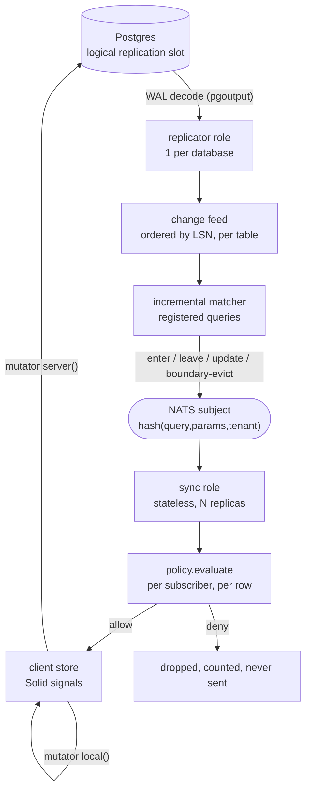

# Realtime internals

Five stages, four processes, one protocol. Ladder rationale and tier choice: [`../idea/03-realtime.md`](../idea/03-realtime.md). Honest sizing of the effort: [`../idea/15-risks.md`](../idea/15-risks.md).

## Pipeline



| Stage | Owner | Guarantee | Cost |
|---|---|---|---|
| WAL decode | `replicator` (1/DB, advisory lock) | ordered by LSN, at-least-once | one replication slot |
| change feed | `replicator` | per-table, monotonic LSN, bounded ring buffer | memory ∝ buffer window |
| matcher | `replicator` | a change touching no registered query costs one hash lookup | CPU ∝ registered query *shapes*, not subscribers |
| fanout | NATS | subject carries no per-socket state | network ∝ subscriber groups |
| socket + policy | `sync` (stateless) | a row failing policy is never written to the wire | CPU ∝ delivered rows × subscribers |
| patch | client | fine-grained signal update, no list re-render | DOM ∝ changed cells |

## Change feed record

```ts
// packages/realtime/src/changefeed.ts
export interface ChangeEvent<R extends Row = Row> {
  readonly entity: string;         // entity name; the matcher's dependency sets are in entity terms
  readonly op: 'insert' | 'update' | 'delete';
  readonly before: R | null;       // requires REPLICA IDENTITY FULL, see below
  readonly after: R | null;
  readonly lsn: string;            // the only ordering authority — see below
  readonly txid: string;
  readonly orgId: string | null;   // hoisted out of the row so fanout filters without parsing it
  readonly at: number;             // commit time, epoch ms
}
```

`before` is mandatory for correct matching: deciding whether a row **left** a result set requires the old values, and with Postgres's default replica identity a delete replicates only the key columns.

**It is warned about and counted, never refused `As of 2026-08-19`.** Three facts, and the third is
the gap:

| | State |
|---|---|
| the code | `X_LIVE_REPLICA_IDENTITY` exists, is registered and is in the manifest (`packages/realtime/src/errors.ts`) |
| the check | `warnPartialIdentity` is preflight's fourth question — it asks `pg_class` which replicated tables sit on `relreplident <> 'f'` and logs the code with the exact `ALTER TABLE` per table (`packages/realtime/src/pg-preflight.ts`). It runs **before** `pg_create_logical_replication_slot`, because a slot decodes with the identity the catalog held when the rows were written |
| the counter | `ReplicationStreamStats.partialBefore` increments on every non-insert change whose relation is not on identity `f` (`pg-replication.ts:344`) — the running half of the same fact |
| the refusal | **missing.** It warns rather than throws, deliberately: every app on the default identity would otherwise stop booting, and a replicator that will not start is worse than the partial rows it is complaining about. No generator emits the `ALTER TABLE` and no `x verify` step reads it, so a table added tomorrow gets a log line and no build error |

Every occurrence in the repo is still hand-written: `examples/dummy/packages/db/migrations/0001_init.sql:106-107` for `posts` and `likes`, and `packages/realtime/src/pg-replication.live.test.ts` for its fixture. Per axiom 3 the *hard* rule does not exist yet — a warning is not a build error → [`wiki/Known-Gaps.md`](../../wiki/Known-Gaps.md).

### The lsn is a pair, not a WAL position

`lsn` is `<16 hex commit position><8 hex row position inside that transaction>` — 24 characters, zero-padded so string order *is* stream order. Neither half is usable alone:

| Candidate | Why it fails |
|---|---|
| commit lsn | every row of one transaction shares it, and the replicator drops anything that does not strictly increase — a five-row insert would deliver one row |
| per-record WAL position | logical decoding emits **transactions** in commit order, so a later-committing transaction can carry lower record positions than an earlier one |
| a counter, or the clock | not reproducible; a replay would produce new lsns and at-least-once delivery would duplicate instead of dedupe |

The pair is monotonic in delivery order *and* byte-identical on replay. The row position counts every replicated row, selected or not, so narrowing the entity list cannot renumber a stream a resume cursor already points into.

`PgLogicalReplicationFeed` speaks the Postgres v3 protocol directly (`pg-wire.ts`, `pg-auth.ts`, `pg-connection.ts`, `pg-socket.ts`) and decodes `pgoutput` (`pgoutput.ts`) — no driver dependency, because a replication connection is CopyBoth and no pooled client will hand one over. It asks **four** preflight questions — `wal_level`, the publication, the replica identity of every entity it replicates, and the slot's decoder plugin. Three throw with a `fix:` of their own, so the misconfigurations that produce an unreadable server message each get an instruction instead; the identity one warns, for the reason above. `slot` and `publication` are interpolated into simple queries, so `assertIdentifier`'s charset is the injection boundary — re-asserted inside `preflight` rather than trusted from the constructor.

## Incremental matcher

Registered queries are stored by shape, not by subscriber:

```
registry: Map<tableName, QueryShape[]>
QueryShape = { queryId, predicate(row, params), orderBy, limit, tables, paramsHash }
```

For each `ChangeEvent`:

| # | Step | Result |
|---|---|---|
| 1 | look up shapes registered on `table` | miss → one hash lookup, done |
| 2 | evaluate `predicate(before)` and `predicate(after)` | `false→true` = enter, `true→false` = leave, `true→true` = update, `false→false` = ignore |
| 3 | for a windowed query (`orderBy` + `limit`), compare the row's sort key to the cached **boundary key** | an enter inside the window emits `insert` **plus** a `boundary-evict` for the row falling off the end |
| 4 | emit one patch op per affected `(queryId, paramsHash, tenant)` group | published to that group's NATS subject |

Constraints that make step 2 cheap enough to be honest about:

- `live: true` requires a **deterministic, bounded** `sql`: total `orderBy` + `limit`, no non-deterministic functions. What enforces it is `assertMatchable` (`packages/query/src/matcher.ts`), which refuses a shape the matcher cannot patch incrementally — an unsupported clause, or a filter operator outside `= != in > >= < <=` — with `X_MATCHER_UNSUPPORTED` and the fix "set `live: false` and poll, or reshape to equality filters + `orderBy` + `limit`". There is no separate `X_QUERY_UNBOUNDED`.
- Predicates must be evaluable against a **single row of a single entity**. `match` returns no patch at all when `event.entity !== shape.entity` (`packages/query/src/matcher.ts:56`), so a join is not a slower live query — it is not one. `Builder#raw(feature)` is how a source declares a shape the matcher cannot patch, and `assertMatchable` refuses it at subscribe time.
- **There is no re-execution fallback, and no aggregate deltas.** `As of 2026-08` the refusal is the whole behaviour: unmatchable is `X_MATCHER_UNSUPPORTED`, never a more expensive correct answer. An honest refusal beats a silently wrong result set, and a fallback nobody wrote is worse than both.
- **Nothing reports which class a query is in before it is subscribed to.** `assertMatchable` runs inside `toLiveQuery` (`packages/query/src/live.ts:125`), which nothing outside `@ultimat3/query` calls, so the refusal arrives at subscribe time and not at build time. There is no explain command — shipped, planned or otherwise.

## Policy is per subscriber, never per query

Two clients can subscribe with **identical** `queryId` and params and still be entitled to different rows: row-level policy reads actor attributes (role, team, ownership, org membership), not just the query parameters.

| Collapse policy to the query | Consequence |
|---|---|
| evaluate once per `(queryId, params, tenant)` and fan out the same rows | the first subscriber's entitlements become everyone's. A member sees an admin-only row because an admin subscribed first |
| cache the allow decision by query hash | privilege escalation with a cache hit rate |

So: fanout is grouped by query shape (that is what makes it scale), and **`policy.evaluate` runs on the `sync` node for every subscriber × every candidate row before the frame is written**. Same `evaluate`, same actor resolution, same denial reason as HTTP and MCP — one authz system ([`../idea/02-primitives.md`](../idea/02-primitives.md)).

`liveQueryDefinition(query, { ctx })` is what makes that reachable from a declared `query({ live: true })`, and the split is in the file: what it caches per query id is the compiled source, the shape and the matcher, and what it never caches is a decision.

| Keyed by | Built | Holds |
|---|---|---|
| query id | once, with `enforce: false` — **no subject at all** | source, shape, matcher, the shared pre-policy row window |
| subscriber | `authorize` at every subscribe, `visible` at every row of every delivery | the decision, and nothing else |

The `enforce: false` is the point rather than a shortcut: building the shared half under the *first* subscriber's authority and then caching it by query id is precisely how that subscriber's entitlements become everyone's. It removes no check — `authorize` is still the subscribe-time decision, and it still runs once per subscriber.

Making that affordable:

| Technique | Detail |
|---|---|
| Subscribe-time snapshot check | the window is read once per subscribe through the query's own source, then filtered per subscriber by `visible` |
| Per-delivery re-check | the incremental path re-checks each row; a denial drops the row and increments a counter |
| Pure predicates | policies must not do I/O; a policy needing a lookup declares the repo, and that lookup is memoized per request/subscription |
| No decision memo | **nothing caches an allow.** A bounded LRU keyed `(actorId, policyId, rowTenant, rowOwnerId)` is the only shape that could ever be safe here, and it is not shipped: without an actor-scoped invalidation to clear it, a TTL of seconds is a revoked grant that keeps delivering rows for seconds. `@ultimat3/query`'s `policy-gate.ts` says the same thing in one line — *its result is never cached* |

A dropped row is a metric (`live.rows_denied`), never a client-visible error — telling a client "there is a row you may not see" is itself a leak. `LiveQueryRegistry` counts every drop (`rowsDenied`) and reports each one through `onRowDenied`, carrying the query id, the subscription, the actor and the row id — never the row.

That is a **denial**. A gate that never reached a decision — a rule whose lookup timed out, a predicate with a typo in it — is a different fact and gets a different number: `live.gate_failed` (`gateFailures`, reported through `onGateFailed` with the stage, the row id and the error). Reading one as the other publishes an outage as a permission change, which is silent by construction: the rows leave the screen and the drop counter explains why.

| Stage | Denial | Failure |
|---|---|---|
| `subscribe` snapshot | row dropped | raises out of `subscribe` — a snapshot missing the undecidable rows is a short result set the client renders as the whole one |
| `deliver` patch | dropped, or a `delete` when the subscriber holds the row | that one subscriber is desynced and re-snapshotted next flush; the fanout to the rest completes |

A patch whose row the shared window does not hold is a third answer and neither of these: an update patch carries the changed columns only, so there is no whole row to decide about. It is withheld — dropped, or the one `delete` that tells a subscriber holding it so — and counted as neither, because nothing decided anything. The window *is* the result set.
| `reauthorize` | unsubscribed, sid returned in `dropped` | the subscription survives, desynced — the row gate still decides every row under the new actor, from the same policy `authorize` consults |

### One lane per query id

The shared window is a read-modify-write across awaits — match, apply the patches, append to the retained buffer, then one policy pass per subscriber — and nothing upstream orders the callers. The `sync` node fires `void registry.deliver(change)` off its bus subscription, because the handler has to return before the next change arrives. Two changes back to back therefore both start, and an interleaved fanout hands one subscriber lsn 2 and then asks it to fold lsn 1 on top: the row settles at the older value, and the cursor is rewound to 1, so the next reconnect replays it again.

`WindowLock` gives every entry a FIFO lane and `deliver` enters every lane before it awaits any of them. Across query ids nothing is ordered and nothing needs to be — a qid pins the query *and* its input, so two entries share no state. Three properties make the lanes safe to hold at once:

| Property | Why |
|---|---|
| No fanout ever takes a second lane | holding all of them at once cannot be a cycle, and entering them all up front is what queues two deliveries onto each query id in call order |
| Each task chains on a settled shadow, never on its own promise | one fanout that threw rejects its own caller; the changes queued behind it still run |
| A lane that fails desyncs its own subscribers, and `allSettled` lets the rest finish | the window advanced under a fanout that did not, so those subscribers hold a cursor below the change; awaiting one entry before entering the next let a throw skip every entry behind it with nobody desynced |

The definition's read shares the same lane and the same rule. It happens **once per entry**: a cold subscriber arriving while another's read is in flight joins it rather than issuing a second one, then runs its own policy pass over the result — the read is shared, the authz is not. It is a share and not a cache; the in-flight promise is cleared as it settles, so a subscriber arriving later reads current rows. And the window it produces is assigned in the lane and only ever forwards: a snapshot that resolved after a newer change had already been fanned out is discarded, because writing it back would hand that subscriber rows the fanout has moved past, at a cursor behind the change that would have corrected them.

The one gate pass outside the lane is a resume, and it reads the live window deliberately: the window can only have moved forwards, and a row whose grant was revoked in the meantime is one the pass must refuse rather than replay from the state it had at the cursor's lsn. An entry nothing has read yet has no live window at all, so a resume onto a cold one fills it first — conditional on purpose, because re-reading per resuming subscriber is the cost a delta resume exists to skip in a restart storm.

## Channel fanout is one filtered `send` per socket

Bun's native WS pub/sub is **not used**, `As of 2026-08` — `SyncSocket.subscribeTopic` no longer calls `ws.subscribe`, and the websocket config declares no `publishToSelf`. Nothing in the package ever published to a native topic, so what those calls built was a second per-topic index nothing read.

| A native publish | Why that disqualifies it here |
|---|---|
| cannot be refused per socket | backpressure on one connection has to be visible as *that connection's* dropped frame |
| cannot report the frame it dropped | the drop counter and the log line are the only trace a lost channel message leaves |
| cannot mark a subscriber desynced | the live-query path's repair runs off exactly that mark |

`WsLike.subscribe` / `unsubscribe` remain **declared and unused**: the interface is structural and a tracked app implements it, so removing the members is a typecheck failure in that app rather than a cleanup. The declaration says so; a reader must not take them for a live mechanism.

Local delivery is `SocketRegistry.deliver(topic, frame)`, reading a per-topic index rather than walking the socket table — that walk cost one iteration per connection on the node for every message with one legitimate subscriber, 50,000 of them at the scale this repo benchmarks.

### A topic guard that fails is not a topic guard that denied

A guard is app code and may reach a database. On the re-auth pass (`ChannelHub.onActorChange`), only a **denial** — `X_TOPIC_FORBIDDEN` or a policy denial — unsubscribes the topic. Anything else keeps the subscription, increments `hub.guardFailures` and logs `channel.guard_failed` with the topic, the socket and the rendered error. `catch { unsubscribe }` reported a store that timed out as a revoked grant: every topic on every re-authenticated socket on the node, silently, with the client never told to resubscribe. The same split `LiveQueryRegistry.reauthorize` makes one layer up, and an alert fires on one of them.

The **initial** `subscribe` is deliberately not split this way: there is no subscription to keep, so a guard that raises rejects that subscribe and the client is told.

## Inbound frames: lanes, and what lanes cannot do

Outbound ordering is the lane per query id above. Inbound ordering is a separate mechanism with a separate unit, because `sync-node.message` dispatches every frame as `void (async () => routeFrame(…))()` — nothing upstream orders them, and a router that awaits a policy, a snapshot read or `onMutate` finishes in whatever order those settle.

**Not one lane per socket** (`frame-lanes.ts`, `As of 2026-08`). A global per-socket lane puts every frame behind the slowest one, and the slowest one is a snapshot read — a database round trip every reconnecting client pays once per live query, which is the restart storm the benchmark measures.

| Frames | Lane key | Why that is the unit |
|---|---|---|
| `mutate` | `mutate`, one per socket | they write the database, and the client numbered them |
| `subscribe` on a query | `sub:<sid>` | `add` then `drop` for one sid, or the drop finds nothing and the add strands the subscription it was meant to end |
| `subscribe` on a topic | `topic:<name>` | one membership, the same add/drop pair |
| `hello`, server-authored kinds | none | they read state and write none of it |

A lane exists only while something is queued on it — the map is empty between frames, because a lane keyed by a client-chosen sid that outlived its work would be an unbounded map one socket can grow at will.

### Caps are reservations, not checks

**A lane does not bound a cap.** N sequential subscribes still pass a check-then-act limit N times, and one of the caps is per *tenant*, which spans sockets where no lane can see it. So every refusal a subscribe can answer with is decided **synchronously, before the first `await`**, against a count that already includes the subscribes still in flight:

| Reservation | Decides | Held until |
|---|---|---|
| `SubscriptionBook.reserve(socket, sid)` | the sid claim (`X_SUBSCRIPTION_ID_TAKEN`), `maxPerSocket`, `maxPerTenant` | the subscription is attached, or the attempt fails — a `finally`, so releasing twice is a no-op |
| `ChannelHub.subscribe`'s claim + `#reserve(topic)` | `maxTopicsPerSocket`, `maxTopicsPerNode`, and the node's one bridge slot for that topic | the socket joins the topic, or the guard denies and the slot is given back |

The bug both close is the ordinary case, not an attack: one WebSocket write carrying N subscribe frames is dispatched concurrently, N of them read a count nothing had grown yet, and every cap was bypassed by batching. The per-socket claim map is a `WeakMap` keyed by the socket, so a connection that dies mid-subscribe takes its claims with it.

### `qid` is a truncated SHA-256

A `qid` is `<name>:<first 16 hex of SHA-256(canonicalJson(input))>` — 64 bits, `As of 2026-08`, replacing a 32-bit FNV-1a. It is `@ultimat3/query`'s `queryHash(name, input)`, over `@ultimat3/core`'s `canonicalJson`/`fingerprint`; realtime held a second spelling of both until 2026-08-19, and the two already disagreed on an input carrying an `undefined`-valued key. One derivation, across the declared `realtime → query` edge. The hash is a **sharing** key: a hit is answered with the existing entry and the seated window, both carrying the first subscriber's input, compiled source and rows, and input is client-chosen — so a second input colliding with the first passes `authorize` against its own arguments and is then served out of somebody else's window. 32 bits is a collision found offline in seconds. `fnv1a` remains the cursor's result-set digest, where a collision costs a missed re-sort and not a result set.

**Deploy consequence, stated once:** a client resuming with a cursor minted under the old format names a `qid` the new node's ring has never held, so `since()` misses and the resume takes the snapshot path (`out-of-window`). One bounded query per subscription, for the length of a rolling deploy. Correct, and not free.

## Shutdown is two phases on a `sync` node

`listenSyncNode` registers both, and `stop()` unregisters both — a hook left behind after the listener is gone drains a node that is already stopped, and the next process-wide shutdown hangs on it.

| Phase | Hook | Effect |
|---|---|---|
| `accept` | `node.stopAccepting()` | `ready = false`: `/readyz` answers 503 and an upgrade arriving anyway is shed with `retry-after-ms`. **Sockets are untouched** — a draining node still owes its clients their patches, and `stop()` is what releases the change subscription that carries them |
| `close` | `node.drain()` then `node.stop()` | `reconnect` frames with per-client delays, the grace window, then close; then the change subscription, the presence sweep and the re-auth interval are released |

Registered with no phase, both landed in `close`, and until that last phase ran `fetch` went on upgrading new websockets onto a process that was going away.

## Cursor and reconnect

Every frame carries an LSN. The client's last-seen LSN is what makes reconnect a delta instead of a refetch.

```
{ qid: 'q_7f3a', op: 'insert', row: {...}, lsn: '0/1A2B3C4', trace: '4bf9…' }
```

Reconnect handshake — the real frames, `As of 2026-08`. There is no `resume` frame and no `reset` frame:

```text
client → { type: 'hello', v, buildId, sessionId: null, actorId }
server → { type: 'hello', v, buildId, sessionId: <socket id>, actorId }
       → { type: 'update-available', buildId } when the socket is build-skewed

client → { type: 'subscribe', v, op: 'add', sid, target: { kind: 'query', qid: <name>, input, cursor } }
server:
  1. reserve the sid and the caps, synchronously
  2. authorize(actor, input), then resolve the shape
  3. cursor === null            → snapshot frame
     cursor inside the window   → patch frame, re-filtered per subscriber   (zero DB work)
     cursor outside / over budget → snapshot frame at the current lsn       (one bounded query)
```

**`target.qid` is the query *name* client → server**; the node derives the real qid from `(name, input)`, so a client can never choose its own fanout key or address someone else's window.

Two ordering rules on the mutation reply, both of which are coordination and not style:

| Rule | What breaks without it |
|---|---|
| The `rebase` frame is sent **before** its `ack` | the ack is the receipt, and the receipt retires the client's journal row and rebase-log entry. A rebase landing after it has no entry to read the mutator's `conflict` strategy from — every merge silently becomes `server-wins` — and no sequence to decide which later optimistic writes to replay |
| A failure `ack` refers to the **mutation key**, or the `sid` for a subscribe | `queue.fail(frame.ref)` looks a mutation up by its idempotency key. Built with the socket id, `ref` names a key no queue can hold and the whole rollback path is inert: the optimistic write stays on screen and the mutation stays queued. The socket id is the honest answer only for a frame that could not be decoded, and for the kinds carrying no reference of their own |

**The `subscribe` target's cursor is the only cursor on the wire.** `hello` carries none: `HelloFrame.resume` was written by the client, read by nobody, and is **deleted** `As of 2026-08`. It could not have been wired, either — a cursor's `qid` is `queryHash(name, input)`, a digest, so `input` is not recoverable from it, and `input` is what `definition.authorize({ actor, input })` decides against and what `matcher(input)` and `#entryFor` need to build an entry at all. A `hello`-time answer could therefore be at most "this node holds an entry under that qid" — a resumability claim made *before* the per-subscriber authorization pass, for a subscription that does not exist yet, over a window that stores **pre-policy** patches. And it could not even have saved the bytes: the client must still send one `subscribe` per sid carrying that sid's cursor, so the field was strictly a second copy.

Removing it moved **no** `PROTOCOL_VERSION` (still `1`), and both skews are readable because `decode` builds a whitelist object rather than passing the parsed one through:

| Skew | What happens |
|---|---|
| new node ← old client sending `resume` | `decode`'s `hello` case constructs `{ type, v, buildId, sessionId, actorId }` and copies nothing else. The field is dropped, not rejected — pinned by `sync-protocol.test.ts`, which decodes a legacy hello and asserts `'resume' in decoded === false` |
| old node ← new client omitting `resume` | the previous `decode` read it as `list(parsed, 'resume', …)`, and `list` answers `[]` for a key that is `undefined` — byte-identical to the empty list every heartbeat already sent. Verifiable only against the previous revision, since that code is gone |

### Cost model

| Scenario | Path | DB cost | Notes |
|---|---|---|---|
| Reconnect inside the buffer window | buffer replay | **0** | the common case: a blip, a laptop lid, a rolling deploy |
| Reconnect outside the window | snapshot | 1 bounded query per subscription | bounded by `limit`, index-backed |
| Cold subscribe | snapshot | 1 bounded query | same as any page load |
| Steady state | matcher + fanout | 0 | changes only |
| Buffer sizing | `buffer.window` per query group; default 30s of ops, capped by bytes | memory | tuned by hand — no command reports the window |
| Never | replaying arbitrary WAL history per client | — | rejected design: it makes reconnect O(history) |

**Snapshot fallback, never WAL replay.** Outside the window the client gets a fresh snapshot at a current LSN. Cost is one bounded query, never history traversal.

### Thundering herd

Dropping N sockets at once means N simultaneous resubscribes during a deploy, when capacity is already reduced — and it is fractal: surviving nodes overload, drop connections, and the herd re-forms.

Mitigations, all mandatory:

| # | Mechanism | Effect |
|---|---|---|
| 1 | Server-directed reconnect frame on drain: `{ type: 'reconnect', afterMs: 1830, resumeFrom: '0/1A2B3C4', reason: 'drain' }` | reconnects arrive spread over a window, not as a spike |
| 2 | Window computed from live connection count | 500 clients drain in a second; 500k spread over minutes |
| 3 | `resumeFrom` LSN | reconnect is a buffer delta, not a resubscribe-and-refetch |
| 4 | Stateless `sync`, no sticky sessions | the LB redistributes clients across remaining nodes |
| 5 | Client backoff is a floor, not the mechanism | a socket lost without a frame still backs off exponentially with jitter. `LiveClient` arms **one** timer per closed socket — the node's `afterMs` when a frame assigned one, otherwise `backoffDelay()` — and the timer calls `connect()`; `close()` cancels it |
| 6 | Per-tenant subscription caps | a registered-query explosion is a load-shedding decision with `X_SUBSCRIPTION_LIMIT`, not a fall-over. Taken as a reservation at the top of `subscribe` (above): the per-socket scope always, the per-tenant scope only when both `maxPerTenant` and `tenantOf` are supplied — and the boot supplies neither `As of 2026-08` ([`packages/cli/src/dev-sync.ts`](../../packages/cli/src/dev-sync.ts) says so and shows the two-line construction that arms it) |
| 7 | Snapshot admission control | snapshot regeneration is queued with a concurrency cap; excess clients get a jittered retry frame |

### The client's half

| Mechanism | Rule |
|---|---|
| One armed timer | a closed socket arms exactly one reconnect — the node's `afterMs` when a `reconnect` frame assigned one, otherwise `backoffDelay()`. `close()` cancels it; `connect()` starts over |
| Identity guard on **every** handler | `onOpen`, `onMessage` and `onClose` all return early when `#socket !== socket`. A replaced socket opening late would otherwise mark the connection up and replay every subscription onto whatever socket is current |
| A reconnect replays registrations **and** topics | topic membership is state on the node's socket and `hello` carries none of it. Missing that half, a channel is silent from the first reconnect on, and its presence membership is swept |
| Heartbeat | `heartbeatMs`, default 15s, `0` disables. One beat = a `hello` + one subscribe frame per topic. A beat and an opening frame are **byte-identical** — `hello` carries no cursors — so the beat says "I am here" and asks for nothing. Two silent windows ⇒ close `4000` and arm the reconnect: a half-open socket fires no `close`, so only the client can end it |
| A `send` that returned is not an ack | a browser `WebSocket.send` on a CLOSING socket discards the frame and returns normally. A drained mutation stays `inflight` until `ack`/`fail`, and a lost connection returns it to `pending` |
| Drain is one pass at a time | passes chain rather than join: two overlapping passes put one key on the wire twice, and a later pass could overtake the one in front of it. Only `pending` entries are sendable |
| Backpressure declines, never fails | over `MAX_BUFFERED_BYTES` (1 MiB, mirroring the node's `backpressureLimit`) the sender throws, the queue keeps that mutation pending and stops the pass rather than reordering the ones behind it. A socket that reports no `bufferedAmount` is treated as never backed up |

Drain sequencing across roles: [`13-topology-runtime.md`](./13-topology-runtime.md).

## What tier 3 adds

`persist: true` on the query. No new mutators, no new authz, no new server code — the client half changes.

| Added | Detail |
|---|---|
| Durable local store | IndexedDB-backed, same row shapes, same signal API |
| Offline mutation queue | `mutator.local()` applies immediately and the intent is persisted, ordered, with its input |
| Rebase log | on reconnect, queued mutations replay against the server-authoritative state per `conflict: 'server-wins' \| 'last-write-wins' \| custom(merge)` |
| Client schema version | the local store is versioned; a mismatch after a deploy discards and re-snapshots rather than reading old shapes |

State that **must** be persisted client-side:

| Key | Why | On mismatch |
|---|---|---|
| store schema version | shapes change with deploys | drop store, re-snapshot |
| last-seen LSN per subscription | delta resume | fall back to snapshot |
| pending mutation queue (input + local patch + idempotency key) | offline writes | replay in order |
| rebase checkpoint | which mutations the server has acknowledged | re-send unacknowledged |
| build ID that wrote the store | detects skew ([`../idea/08-pwa-offline.md`](../idea/08-pwa-offline.md)) | discard on incompatible contract |

Requirements this places on `mutator.local`: pure function of `(tx, input)` — no I/O, no `Date.now()`, no `Math.random()`. It is replayed, possibly many times, possibly on a later build.

## Limits — stated plainly

`As of 2026-07`, tiers 1–2 are the v1 target; tier 3 is v2. The sync engine is roughly 70% of the framework's total effort ([`../idea/15-risks.md`](../idea/15-risks.md)).

| Limit | Reality |
|---|---|
| Matcher generality | single-row, single-entity predicates only. Multi-table joins and non-trivial aggregates are **refused** at subscribe time (`X_MATCHER_UNSUPPORTED`), never re-executed, and no command tells you the class in advance |
| Matcher throughput | CPU on one `replicator` per database. A high-write table with many distinct query shapes is the bottleneck, not socket count |
| Memory per subscriber | grows with subscribed-result size. 100k sockets holding 50-row results is fine; 100k holding 5k-row results is not |
| Ordering | per table, by LSN. There is no cross-table transactional snapshot on the wire; a UI that requires one must read via a query, not a subscription |
| Delivery, tier 2 | at-least-once. Patches are idempotent by `(qid, lsn, rowKey)`; clients must tolerate a repeat. A patch backpressure drops marks the subscriber `desynced`, and the next change re-snapshots it out of the shared window |
| Delivery, tier 1 | **at-most-once, and unrepaired.** A channel topic has no cursor, no mark and no re-snapshot, so a frame `SyncSocket.send` refuses is gone. It is counted — `channel_frames_dropped_total` (no labels; a topic is client-chosen), `channel.frames_dropped` at `warn` with `{ topic, dropped, total }`, and `SocketRegistry.droppedChannelFrames` in process. Repair would need a per-topic sequence on the wire: a channel's `lsn` is the publishing hub's own per-node counter, so a client cannot tell a gap from a message that came via another node |
| Bun process maturity | long-running socket processes are less battle-proven than Node's; sustained-load memory profiling is explicit roadmap work |
| Escape valve | if the reconnect benchmark says our matcher is the bottleneck, adopting an existing protocol (Zero-shaped) beats defending ours |

## Codes

Every code below is registered and in [`framework.manifest.json`](../../framework.manifest.json); the full row per code is [`wiki/Error-Codes.md`](../../wiki/Error-Codes.md).

| Code | Meaning | Fix |
|---|---|---|
| `X_SUBSCRIPTION_LIMIT` | a per-socket, per-tenant or per-node cap was reached; the error carries the scope, the id, the limit and the knob | raise `maxPerSocket` / `maxPerTenant` / `maxEntries` on the `LiveQueryRegistry`, or `maxTopicsPerSocket` / `maxTopicsPerNode` on the `ChannelHub`. None is an `app.config.ts` field |
| `X_SUBSCRIPTION_ID_TAKEN` | one socket reused a `sid` it already holds, or claimed one twice in one batch | pick a fresh `sid`; a subscription is `(socket, sid)` and replacing one strands it |
| `X_MATCHER_UNSUPPORTED` | a `live: true` shape the incremental matcher cannot patch — an unsupported clause or filter operator | `live: false` and poll, or reshape to equality filters + `orderBy` + `limit` |
| `X_REPLICATOR_SLOT_HELD` | a second replicator found the advisory lock held | scale `replicator` to 1 per database |
| `X_CURSOR_STALE` | the cursor is outside the retained window and no snapshot path was supplied | pass `snapshot` to `resumeFrom()`, or raise the ring's capacity |
| `X_FRAME_RATE_LIMIT` | one socket sent frames faster than this node will route them | `createSyncNode({ maxFramesPerSecond, frameBurst })`; the budget is checked before `touch()`, so a refused frame does not renew the idle window |
