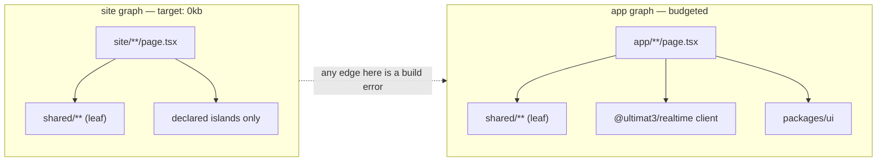

# Rendering internals

Five render modes, two bundle graphs, one invalidation graph. Mode semantics and SEO enforcement: [`../idea/07-rendering-seo.md`](../idea/07-rendering-seo.md). Surface rules: [`../idea/06-surfaces.md`](../idea/06-surfaces.md).

## Two bundle graphs

Axiom 6: the static path never pays for the app path. That is a **build architecture**, not a guideline.



| Property | `site` graph | `app` graph |
|---|---|---|
| Roots | every `site/**` route module | every `app/**` route module |
| Output dir | `.x/build/site/` | `.x/build/app/` |
| Runtime included | none by default | Solid runtime + router + realtime client |
| Chunk manifest | separate file | separate file |
| Shared code | `shared/**` is compiled **into each graph separately** | same |
| Budget | `js: '0kb'` default | per-route `budget.js` |

`shared/**` is duplicated across graphs rather than extracted into a common chunk. A shared chunk would let an app-only dependency ride along into a site page — the exact failure the boundary exists to prevent. Duplicating a few kB of button markup is cheaper than one charting library.

## How 0kb is achieved

| Step | Mechanism |
|---|---|
| 1 | Solid's compiler emits template-cloning code, not a component tree. A `render: 'static'` route is evaluated at build time and serialized to HTML |
| 2 | No script tag is emitted unless the route declares an island (`hydrate` other than `never`) |
| 3 | Critical CSS is inlined from the SCSS modules the route actually used; the rest is a deferred `<link>` |
| 4 | The theme script is a byte-capped inline literal (see [`10-cross-cutting.md`](./10-cross-cutting.md)), counted against the route budget |
| 5 | `<Image>` emits `srcset` + inlined dimensions + a data-URI blur placeholder — no JS involved |
| 6 | Interactivity without JS: `<details>`, CSS `:has()`, scroll-snap, native `<form method="post">` to an `api/` action |

Enforcement, all build errors:

| Check | Code |
|---|---|
| Any `site` graph node resolving into `app/` (transitively) | `X_BOUNDARY_VIOLATION` with the chain |
| A `site/` route emitting >0 bytes of JS without an explicit `hydrate` | `X_BUDGET_EXCEEDED`, `data.cause` = the import that pulled JS in |
| A `shared/` module exceeding its own byte budget | `X_BUDGET_EXCEEDED` — `shared/ui` cannot silently fatten |
| Raw `` in `site/` | `X_BOUNDARY_VIOLATION` (`rule: raw-img`) |
| Budget regression vs. the recorded baseline | ratchets tighten, never loosen silently |

## Island boundaries

An island is the unit of hydration: a component with a `hydrate` timing, its own chunk, and a serialization boundary.

```tsx
<Island hydrate="interaction">
  <PriceCalculator plans={plans} />
</Island>
```

Emits:

```html
<x-island id="i3" h="interaction" c="/_x/app/i3.a91f.js" p="/_x/app/p/i3.json"></x-island>
```

| Rule | Detail |
|---|---|
| Props cross a boundary | must be structured-clone serializable. A function or class instance is `X_ISLAND_PROPS_INVALID` |
| Props transport | inlined JSON for small payloads, a separate `p` fetch above the size cap |
| Children | server-rendered HTML by default; a child needing its own timing becomes its own island, nested |
| Chunking | one chunk per island, content-hashed. Two islands importing the same module share a sub-chunk **within the same graph** |
| Context | server context does not cross the boundary. An island reads `ctx` values passed as props, or the client-side locale/theme/tz signals |
| Counting | islands and their bytes are attributed to the route in `budgets.report`, so a new island shows up as a byte delta with a named cause |

## Streaming envelope (`stream` mode)

Shell first, holes later, out of order.

```
HTTP/1.1 200  Transfer-Encoding: chunked  Content-Type: text/html; charset=utf-8

<!-- flush 1: immediately, no query awaited -->
<!doctype html><html><head>…meta from the route…</head><body>
<div id="app"><header>…</header>
  <div data-h="1"><!--stats skeleton--></div>
  <div data-h="2"><!--feed skeleton--></div>
</div>
<script>window.__X_R=(i,e)=>{/* 380B resolver: swap template into data-h */}</script>

<!-- flush 2: the fast query resolved -->
<template id="t2">…feed html…</template><script>__X_R(2,'t2')</script>

<!-- flush 3: the slow query resolved -->
<template id="t1">…stats html…</template><script>__X_R(1,'t1')</script>

<!-- trailer -->
<script>__X_R.done()</script></body></html>
```

| Property | Detail |
|---|---|
| Order | resolution order, not source order. Hole 2 landing before hole 1 is normal |
| Resolver size | a fixed ~380 byte inline function, the only script a `stream` route needs before islands |
| No shell hydration | Solid patches streamed HTML into place; the shell costs **zero** hydration work. A `<Suspense>` boundary hydrates only its own island, only when its `hydrate` timing fires |
| Error in a hole | the hole receives an error boundary's HTML plus the `UltimateError` code; the rest of the page is unaffected |
| Drain past deadline | a stream cut by `DRAIN_TIMEOUT` gets a typed truncation trailer, not a socket reset ([`13-topology-runtime.md`](./13-topology-runtime.md)) |
| Crawlers | the full document is emitted; nothing depends on client JS to become visible |

In a VDOM framework a streaming shell still pays to hydrate the whole tree — streaming buys TTFB but not TBT. Here it buys both.

## Four hydration strategies

| `hydrate` | Emits | Wakes when | Use |
|---|---|---|---|
| `idle` | island chunk + `requestIdleCallback` (timeout fallback) registration | the main thread is free | app default; above-the-fold interactive regions |
| `visible` | island chunk + one shared `IntersectionObserver` for all `visible` islands | the marker enters the viewport (+ rootMargin) | below-the-fold widgets |
| `interaction` | island chunk + a delegated capture-phase listener on the marker for `pointerdown`/`focusin`/`keydown` | the user first touches it; the triggering event is replayed after hydration | menus, modals, calculators |
| `never` | **nothing** — no chunk, no marker script | never | static islands, all of `site/` by default |

One observer and one delegated listener serve every island on the page — per-island observers are how "a few islands" becomes a measurable regression. `never` is the only strategy that emits zero bytes, which is why it is the `site/` default and why opting out of it is explicit and budgeted.

## ISR: single-flight regeneration

```
GET /blog/hello
  ├─ fresh copy in tier 3?            → serve, X-X-Cache: hit
  ├─ stale copy?                      → serve stale immediately
  │                                     + try-acquire regen lock (route,params)
  │                                        acquired → enqueue regenerate job
  │                                        held     → do nothing (single-flight)
  └─ no copy?                         → render inline, store, serve
```

| Element | Mechanism |
|---|---|
| Lock | `SET x:isr:lock:<routeId>:<paramsHash> NX PX 60000` in Redis; advisory lock when Redis is absent |
| Regeneration | a `job`, not an inline render — so a burst of 10k requests costs one render and the origin is never the bottleneck |
| Storage | tier 3 (Redis) is **required** for ISR: regeneration happens on a different instance than the write ([`../idea/05-caching.md`](../idea/05-caching.md)) |
| Serving during regen | the stale copy, with `stale-while-revalidate` so the CDN does the same |
| Failure | regen failure keeps the stale copy and logs `isr.regenerate.failed` (`packages/render/src/render-isr.ts:250-256`); a stale page never becomes a 500. It throws no error and carries no `X_*` code — the request already had an answer |
| Prerender | `prerender()` supplies the initial param set at build; params discovered at runtime are recorded for the reverse index below |

## Tag → page dependency lookup

Invalidating `tag.post` must find the pages that depend on it, in one hop.

| Direction | Built | Contents |
|---|---|---|
| Build time | from `revalidate.tags` on every route | `tag → routeId[]` (static half, lives in `x.manifest.json`) |
| Runtime | recorded when a page renders | `tag:<name>:<id> → (routeId, paramsHash)[]` as a Redis set (dynamic half) |

A route declaring `revalidate: { tags: [tag.post] }` and rendering `/blog/hello` from post `p_42` adds `/blog/hello` to the set for `tag.post.id(p_42)` **and** to the route-level set for `tag.post`. So `tag.post.id(p_42)` evicts one page; `tag.post` evicts the route's whole rendered set. Narrow eviction is the ergonomic default precisely because the narrow index exists.

## One `invalidates`, five destinations

```ts
cache: { invalidates: [tag.post, tag.feed] },
```

Fanout is enqueued in the same transaction as the write and executed post-commit (stage 14 of [`03-request-lifecycle.md`](./03-request-lifecycle.md)):

| # | Destination | Mechanism | Timing |
|---|---|---|---|
| 1 | tier 1 request memo | drop entries carrying the tag | immediate, same request |
| 2 | tier 2 in-process LRU, **all instances** | tag-invalidation message on NATS | ~ms, best-effort; a missed message costs a stale read until TTL, never a wrong write |
| 3 | tier 3 Redis | `SREM`/`DEL` over the tag's key set | immediate |
| 4 | ISR pages | reverse index → mark stale → single-flight regen job | next request serves stale, regen in background |
| 5 | CDN | purge-by-URL for the affected route set via the configured purge webhook | seconds; `stale-while-revalidate` covers the gap |

Live queries are a **separate path**: the same commit already flows through logical replication ([`07-realtime-internals.md`](./07-realtime-internals.md)). Realtime never depends on cache invalidation succeeding.

A rolled-back write never purges. A committed write always does. `x cache graph --json` would print
what a write will evict before you run it — **planned, not shipped**: `x cache` is in the registry
and `x help` lists it, and running it exits `X_NOT_IMPLEMENTED` naming its own fix,
`x dev` and the cache panel at `/_x`. The graph itself is real — `x.manifest.json` carries it — and
`recentInvalidations()` is what the panel reads.

## Codes

| Code | Meaning | Fix |
|---|---|---|
| `X_BUDGET_EXCEEDED` | route bytes / LCP over budget; `data.cause` names the import chain | `x fix boundary <file>` |
| `X_ISLAND_PROPS_INVALID` | a non-clonable prop crossed an island boundary | pass an id and look it up inside the island |
| `X_ISLAND_INVALID` | an island declaration cannot become a client entry | correct the `src` to the `.island.tsx` file the cause names |
| `X_ISLAND_NOT_HYDRATED` | a page renders an island that nothing would ever boot | declare it on the route, or drop the render |
| `X_ROUTE_META_MISSING` | required metadata missing (`@ultimat3/render`) | `add description to meta in <the named route file>` |
| `X_SEO_META_MISSING` | a `site/` route is missing required metadata (`@ultimat3/seo`) | same edit, named by `packages/seo/src/validate.ts` |
| `X_ROUTE_OFFLINE_MISSING` | `defineRoute()` with no `offline`, or one outside `precache \| runtime \| network-only` | `add offline: 'precache' \| 'runtime' \| 'network-only' to defineRoute` |
| `X_ROUTE_MODE_INVALID` | render mode not allowed on this surface | change `render` to one this surface permits |
| `X_SURFACE_BOUNDARY` | a surface imported across the hard boundary | `x fix boundary <file>` |
| `X_PRERENDER_FAILED` | a prerendered path threw during build | fix the `load` the cause names |
| `X_BUILD_SKEW` | client build ID incompatible with the current contract | client-side reload signal |

Two names the design docs use are **reserved, not raised** `As of 2026-08`
([Error codes → Reserved codes](../../wiki/Error-Codes.md#reserved-codes)):

| Reserved | What happens today |
|---|---|
| `X_SW_UNCACHEABLE` | an `offline` strategy contradicting the route's `render` mode is **accepted**. `X_ROUTE_OFFLINE_MISSING` checks the strategy's own validity, never its agreement with the mode; `X_SW_SCOPE_INVALID` covers only the scope half |
| `X_SW_HAND_EDITED` | `sw.js` carries no checksum, so a hand edit survives `x build` and is silently overwritten on the next one |
